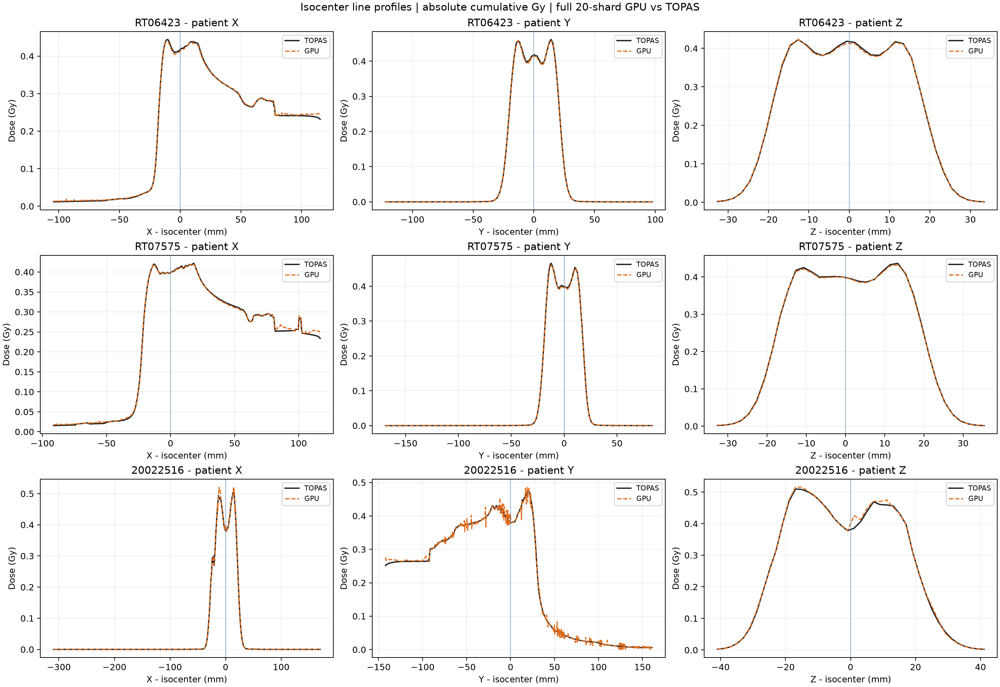

# 当前结果索引

更新日期：2026-09-05。这里只索引冻结结果，不覆盖旧数值，不以一次验证替代其他计划门禁。

## 最新：TOPAS 10x，三个病例完整 GPU 统计

[完整报告、配置、图及外部剂量路径](../benchmark/topas10x/gpu_current_20260905.md) ·
[总证据/SHA](../evidence/step-31/topas10x-current-20260905/summary.json) ·
[profile manifest](../benchmark/topas10x/gpu_current_20260905_profiles/profiles_manifest.json)

60/60 shards accepted、零 overflow，共 457,898,870 histories；
GPU 与 TOPAS 每病例实际 histories 匹配。
GPU 为本地 RTX 2080 Ti，冻结 executable SHA256：

`6ae10bb7e11bed70a9ce602a6ba25d141cfa7ad641158162f747a00b12570c0a`

包含当时已有的 entrance-mask candidate。它不代表之后工作树里的纵向响应候选通过验证，
也不提升数据包版本。

### Global Gamma 通过率（%）

| 病例 | 3%/3mm | 2%/2mm | 1%/1mm | 3%/0mm |
|---|---:|---:|---:|---:|
| RT06423 | 100.00 | 99.96 | 98.58 | 99.97 |
| RT07575 | 99.97 | 99.57 | 96.74 | 99.28 |
| 20022516 | 100.00 | 99.94 | 98.79 | 94.27 |

### Local Gamma 通过率（%）

| 病例 | 3%/3mm | 2%/2mm | 1%/1mm | 3%/0mm |
|---|---:|---:|---:|---:|
| RT06423 | 99.88 | 99.26 | 87.50 | 92.28 |
| RT07575 | 99.61 | 98.44 | 83.32 | 89.14 |
| 20022516 | 99.94 | 99.61 | 84.97 | 81.36 |

全 reference ≥10% 全体积峰值，无 BODY mask，无 LS scale。
非零距离为 0.5 mm 球内格点 + 三线性插值，30 为同体素剂量差。
上表是全阈值区域，不是 50k 抽样；精确值以链接 JSON 为准。
[完整验收定义](scoring_validation.md)。

profile 为 3D DoseToMedium 的患者 X/Y/Z 取线；不是 IDD，也不能替代全 3D Gamma。

## 当前能说什么，不能说什么

本批支持这三个病例及其冻结输入下的 research dose 一致性。
Local 严格指标仍有残差，20022516 Global 3%/0mm 最弱。
入口低密度区域及非均匀组织局部差异值得继续诊断，
但本批结果不能独立证明“剩余误差全是电子”或“必须调核 package”。

不把旧单 shard 约 98% 结果及当时的 INCLXX/BIC 推测当作当前结论。
不声明临床准入、通用电子输运、任意能区/密度泛化、LET 验证或 plan2 完成。

## 其他证据与进度

- [原 Schneider 工作流](../plan/README.md)：其历史阶段有自己的 scope/门禁。
- [电子响应计划](../plan2/README.md)：当前状态表为准；联合响应和密度/几何门禁仍未全部通过。
- [plan2 结论日志](../plan2/conclusion.md)：追加式历史；后续修正可撤销早期表述，不可只读旧 DONE。
- [Step 13](../evidence/step13/step13-validation-summary.md) /
  [Step 14](../evidence/step14/step14-validation-summary.md)：历史 attenuation/stopping 证据，
  对应 fixtures 已部分归档；不是清理后重新跑过测试的证明。
- [历史文档](archive/README.md)：旧 CT/LET、FRED、多离子/minibeam、单 shard、
  LS/BODY-mask 结果只用于溯源，不混入当前表。

若冻结结果与当前源码或配置不同，保留两者并标明版本差异，不重新解释成同一运行。
