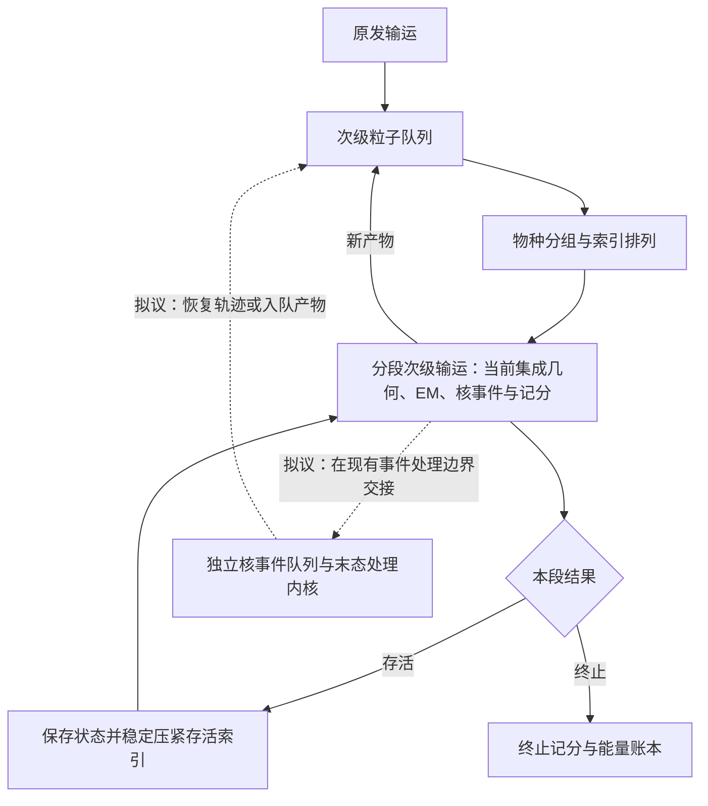

# GPU 输运结构、occupancy 瓶颈与改造路线

日期：2026-09-15。源码基线：`7d85347`。主要目标设备：本地 RTX 2080 Ti，sm_75。

本文面向后续实施代码优化的开发者，记录瓶颈证据、改造优先级、失败经验和验收方法。目标是在保持当前物理模型及数据不变的前提下提高吞吐，而不是单独追求更高的 occupancy。以下改造路线是待实施方案，不代表已获得对应收益。

## 1. 当前结构与已经完成的优化

当前生产默认已启用：

- 次级每 16 个完整物理步暂停，保存状态并稳定压紧存活索引，再继续输运。
- 精确 EM 查表索引：缩小二分查找范围，保留原节点、区间选择与插值。
- 紧凑续跑状态：`SecondaryResumeState` 为 272 字节，按 16 字节对齐。
- 续跑恢复后，将 `UnifiedEmState::tables` 重新绑定到当前内核的 `unified_device`。捕获对象的指针不能跨 launch 直接复用。

上述项目不能继续列为“尚未实施”的优化。现有回退预设保留 64 步续跑及索引关闭路径。

虚线是待验证的结构改造。当前实现没有因此新增独立核事件队列。

## 2. 如何理解低 occupancy

Occupancy 表示驻留 warp 数占硬件允许最大值的比例。它不同于以下指标：

- **活跃线程比例**：某条指令实际由一个 warp 中多少线程执行。
- **Eligible warp**：当前已满足依赖、可以发射指令的 warp。
- **内存带宽利用率**：显存接口实际搬运数据的速率。
- **吞吐量**：包含初始化、内核、回读等开销后的有效粒子处理速度。

低 occupancy 会限制隐藏访存延迟的能力，但提高 occupancy 不保证提速。若减少寄存器导致 spill、重复加载或更多指令，最终可能更慢。增加排队粒子数和显存占用，也不能突破单个 SM 的寄存器容量。

### 2.1 已有硬件证据及适用范围

以下来自历史生产二进制的代表性 Nsight Compute 采样，**不是当前 `7d85347` 的计数器复测**。采样对象是一个原发启动和首轮分段次级启动，不是全病例所有启动的加权平均。

| 历史指标 | 原发 | 分段次级 |
|---|---:|---:|
| 每线程寄存器 | 255 | 203 |
| 理论 occupancy | 25.00% | 25.00% |
| 实际 occupancy | 24.62% | 24.84% |
| 每 warp 平均活跃线程 | 19.18/32 | 14.92/32 |
| SM 吞吐占峰值 | 7.55% | 7.43% |
| DRAM 吞吐占峰值 | 16.05% | 21.29% |
| 调度器无 eligible warp 的周期比例 | 91.95% | 92.60% |
| long_scoreboard，占平均发射间隔约 | 57.88% | 56.92% |
| no_instruction，占平均发射间隔约 | 24.48% | 26.67% |

历史时间线中，次级约占原发与次级内核合计时间的 65%，主机设备 memcpy 合计约 0.164 秒。拷贝时间短不能排除内核内部访存瓶颈。

sm_75 每 SM 有 65536 个 32 位寄存器，最多驻留 32 个 warp。历史原发使用 255 寄存器/线程、128 线程/block，按分配粒度约占 32768 寄存器/block，只能驻留两个 block，即 8 个 warp、25% occupancy。次级也受到寄存器分配限制。必须按实际 block 大小及分配粒度重新计算，不能只根据寄存器总数连续估算收益。

`long_scoreboard` 指向等待 L1/TEX 路径的数据依赖，可能涉及 global/local/texture 访问；尚不能直接归因于某一张表。`no_instruction` 提示取指供给值得调查，但不能据此断定某种指令缓存改造必然奏效。这些是 warp 发射间隔分类，不是能直接相加的独立墙钟损失。

证据：[历史硬件分析](benchmark/ctbenchmark20260915/result/hardware_profile/README.md)、[最新索引验证](docs/em_exact_index_optimization.md)、[调度验证](docs/secondary_scheduling_latest.md)。不同版本的数字必须分开引用。

### 2.2 当前代码中的重点检查对象

- **次级大内核与变量存活期。** 次级循环集成几何、EM、核反应、诊断与记分，多组变量跨分支存活。低频路径可能影响整个内核的寄存器分配和指令体积，但具体影响须通过编译结果确认。
- **串行查表依赖。** EM 查询包含节点和多种分段函数查找；即使已启用精确索引，仍有地址依赖及读取等待。不能把“比较次数减少”直接等同于“访存延迟解决”。
- **长短轨迹混跑。** 物种相同不意味着剩余工作量相同。材料、能量、方向及剩余射程影响完成时间，造成同 warp 内部分线程提前结束。
- **状态布局与重建成本。** 缩小全局续跑结构可减少状态搬运，但不等于线程寄存器同比下降。重建表视图也可能引入额外地址计算与加载。
- **剂量原子累加。** 当前已有同体素累积后再提交的路径，不能笼统建议“取消每步 atomic”。应先确认原子争用是否出现在真实热点中，再评估改造。

## 3. 分阶段改造路线

### P0：重新测量当前生产版本

固定源码、编译器、编译选项、二进制 SHA、物理数据 SHA 和病例配置。使用不插桩运行记录真实性能，使用独立 profiling 运行定位瓶颈，不将 profiler replay 时间作为正常吞吐。

覆盖原发、首代次级以及后期续跑的代表性启动，采集寄存器数量、local load/store 与 spill、理论/实际 occupancy、活跃线程、eligible warp、缓存命中、long_scoreboard 和取指等待。结合 SASS/指令位置采样定位加载及分支热点。

输出应回答：最新版是否仍受寄存器限制；哪个阶段贡献最多耗时；需要跨过哪个实际资源分配档位；哪些等待来自表读取、状态读取或原子操作。未取得这些数据前，不继续引用旧 25% 作为当前值。

### P1：固定生产配置的编译特化

优先处理生产配置关闭、但仍可能留在通用内核中的诊断与独立弹性分支。由主机选择有限数量的编译特化内核，使相关分支和临时变量在编译期消失；保留研究路径以及必要的能量、终止和 overflow 账本。

避免为每个配置开关生成全部组合。首先仅比较一个常用生产特化与现有通用路径，检查生成代码是否确实减少寄存器或指令体积。仅增加模板参数而生成代码没有改善，不算优化完成。

### P1：缩短变量存活期

依据热点加载与编译信息检查跨几何、EM、核末态分支存活的临时变量，将只在局部阶段使用的变量限制在相应作用域。对少数低频复杂路径评估独立函数或后续队列处理；不假设加 `noinline` 就能减少资源成本。

必须同时检查寄存器分配、spill、重复加载与内核时间。此前直接拆解插值字段的尝试已失败，不再把机械删除结构体临时对象作为默认优化方法。

### P2：分离低频核事件处理

常用输运内核在**现有事件处理边界**交接，保存足够状态，由核事件内核生成末态，再恢复轨迹或将产物加入次级队列。不能仅为方便拆分而移动 EM、核事件、MCS 或记分的执行顺序。

交接必须保持：碰撞位置与能量、RNG 身份与计数、剩余随机状态、代数限制、待提交剂量、能量账本以及唯一的终止处理。新增队列必须具有容量检查，overflow 使运行无效。

先限定为一个已支持的事件路径进行实验，量化主内核资源下降是否抵消额外 launch、队列操作与全局状态读写。该方案不是把一个完整物理步拆成多个近似步骤。

### P2：按剩余工作量分组

在现有物种分组上，测试有限数量的剩余射程桶。仅重排活动索引，保持粒子身份、权重、RNG 状态、精确边界及截断规则。首先在现有续跑边界重组，不额外增加物理步内排序。

将分桶、索引写入和恢复成本计入总时间，同时测量 active lanes 和尾部耗时。桶数量与重组频率必须通过配对实验选择，不预先假设分组越细越快。

**已实现（物种 × 16 能量桶，2026-09-15）。** 只改索引重排：把最小 `sp*18` 物种键扩展为
`(species, floor(log2(8E)) 截断到 0..15)`，仍只用两个直方图/散射核，在每代批次起点执行一次。
这样同一 warp 内粒子落在相同物种与相近能量，`nodes`/`segments`/`delta_means` 的精确索引探针
命中同一缓存段，降低 `long_scoreboard`。未改任何输运算式、RNG 身份、边界或截断。

固定 RT07575 `hardware_profile/profile.yaml`（3,240,963 原发，sm_75）配对实测：生产基线二进制
`b624b4132a56`，候选 `c7e6528df6f5`（源码含本改动，同时是重建后的 `build/oneapi-nvidia-release/carbon_mc`）。
穿插多次重复，原发 9.6s 不变，次级 kernel 中位数 **15.70→14.86s（约 +5.3%）**，程序 Elapsed 中位数
**29.79→28.96s（约 +2.7%）**，吞吐约 109k→112k histories/s。全部运行质量通过、零 overflow；
同体素最大剂量差约为峰值的 5–10×10⁻⁵ %，与基线自身重复波动同量级，属原子累加次序舍入。

16 与 32 能量桶配对无显著差别，故取 16。曾尝试把出生体素 Schneider 分区并入键
`(section, species, energy)`（26×19×16 桶），次级约慢 3%（`binary_secbucket`），
判定为重组收益被分区/密度漂移与额外原子桶抵消，已回退。证据与逐次剂量保存在
`scratch/opt_gpu_20260915/`（`ab_results.json`、`binary_final`、`binary_secbucket`、`binary_e16_clean`、`binary_e32_clean`）。
这仍只是同网格 GPU 自对照，不代替患者 BODY TOPAS Gamma 或低密度阈值验收，也未在核弹性开启路径复测。

### P3：状态布局与访存优化

在指令与地址采样支持后，评估热冷字段分离、SoA/AoSoA、状态访问合并和查表加载安排。比较一次连续结构读取与多个分散数组读取的代价，不直接宣称 SoA 一定优于 AoS。

保留 16 字节对齐及恢复后表指针重绑定。不要重新引入跨 launch 指向捕获对象的指针，也不要为缓存查找区间增加大量持久状态，重复此前 sticky interval 的回归。

## 4. 已失败或不应优先重复的方向

| 方向 | 已有结果或问题 | 后续处理 |
|---|---|---|
| 盲目使用 `maxrregcount` | spill 可抵消 occupancy 收益 | 只有活跃变量结构已改善时再验证 |
| 固定 32/64/128/256 线程块 | 历史扫描整体慢约 1–2% | 内核资源特征发生变化后再评估 |
| Philox 输出 buffering | 增加寄存器、补充随机数的分歧；曾出现跨步流相关问题 | 不改变 RNG 流定义，不作为优先项 |
| sticky interval 缓存 | 最新记录中状态 272→304 字节，整体约慢 9% | 不重新引入同类持久提示状态，除非有新证据 |
| 直接展开 EM 插值字段 | 审计一致但最新记录约慢 3% | 不能用源码看起来更简单判断 codegen |
| 继续缩短续跑间隔 | 8 步收益低于 16 步候选 | 保留现有默认，不重复无依据扫描 |
| 继续增加显存占用 | 可摊薄初始化，但不能突破 SM 资源限制 | 与内核优化分开评估 |

详见[失败方案记录](docs/rejected_approaches.md)。该文件中的历史“区间索引无收益”与后来精确索引的生产收益并不矛盾：必须核对物理实现、状态结构、编译参数和基线版本，不能把一次失败永久推广到不同实现。

宏步近似、删减 δ 电子能量、修改涨落分布、降低核过程覆盖均不属于本文代码结构优化路线。FP64 替代 FP32 也不作为此处的优化方向。

## 5. 实验、验收与推广

### 性能实验

- 每个方案先独立验证，再测试组合；禁止跨实验直接累加收益百分比。
- 固定 RT07575 输入与种子，候选至少重复三次，基线穿插运行；记录温度、时钟、其他 GPU 负载及二进制 SHA。
- 同时报告完整进程 wall、程序 Elapsed、初始化、原发/次级内核、压紧和回读耗时，说明计时范围及嵌套关系。
- 使用硬件计数器确认实际寄存器档位、spill、eligible warp 和活跃线程变化。即使 occupancy 提高，只要整体变慢就不采用。
- 小于重复波动的收益标为“不确定”，不宣称稳定加速。不使用 NCU 自动估算值承诺收益。

### 正确性实验

- 运行前校验固定 Schneider v2.1、统一 EM 及其矩数据，不降级或替换数据路径。
- 要求质量报告通过、剂量值有限、队列零 overflow；检测到 overflow 必须拆分并重跑。
- 检查恢复前后的 RNG 身份与状态、事件及能量账本、待提交剂量和唯一终止处理。拆核及重排不能造成重复记分、漏记或重复抽样。
- 比较剂量差与同一基线自身重复波动；超出波动时先定位原因，不因“只是代码优化”自动接受。
- 有稳定收益后检查 RT06423、20022516 和水模，并验证改动影响的弹性开启路径。记录单次观察与重复结论的区别。
- 涉及事件重排或记分路径变化时，追加 BODY 内 TOPAS Gamma：仅统计 RTSTRUCT BODY 内体素，DTA>0 时搜索步长为 DTA/10，DTA=0 做同体素比较。GPU 自对照不替代 Gamma 验收。

### 接口与推广约束

本文仅新增分析文档，不新增运行 API，不修改生产配置或物理数据。后续实验采用隔离构建、明确日志标记和可回退开关，先验证再推广，不提前切换生产默认。

结论按“重复实测”“单次观察”“待验证假设”分级记录。最终目标是保持物理结果与审计完整性，提高端到端吞吐；occupancy 是解释性能的指标之一，不是独立验收目标。
