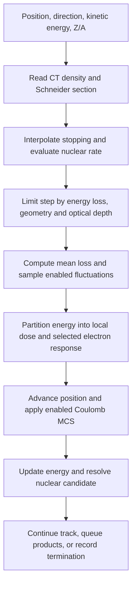
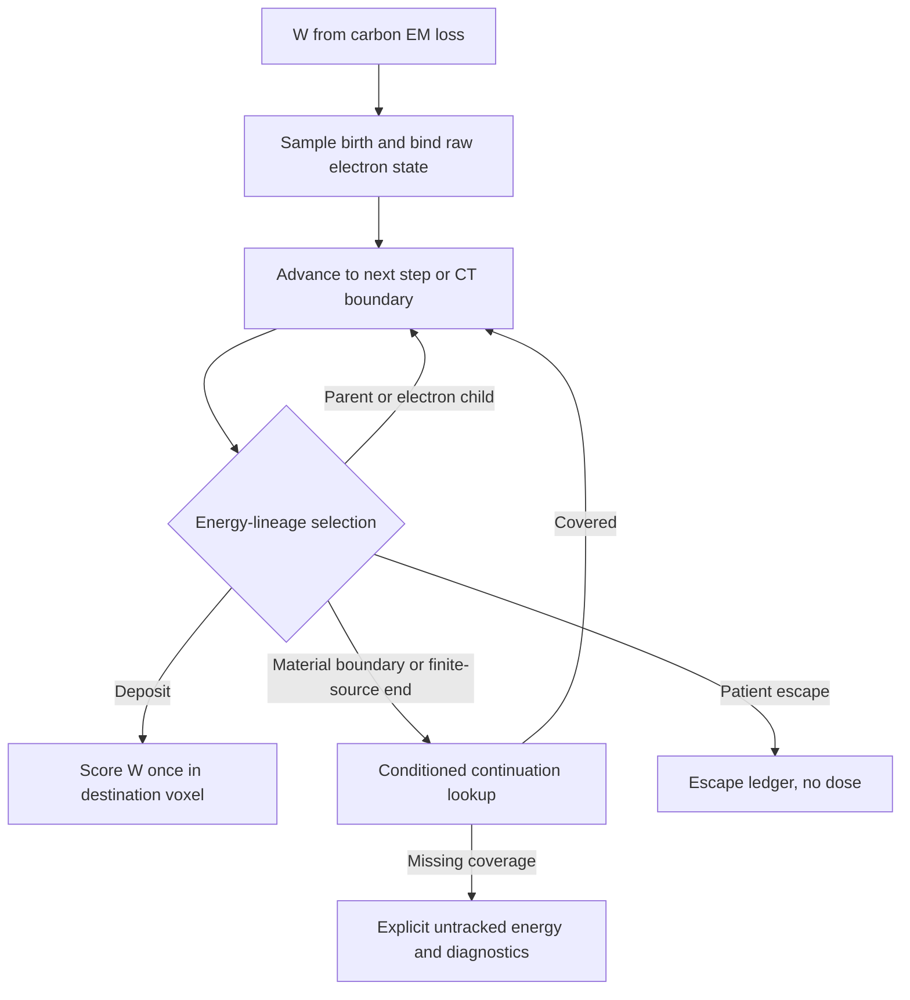

# Materials and Methods

Revision: 2026-09-10. Current research draft, not a clinical or general Geant4-equivalence claim.
[中文](mm_zh.md). The [physics specification](docs/TOPAS_GPU_Physics_Model.md) describes the September 5 baseline;
subsequent implementation changes are identified below and checked against source code.
Original drafts, including exploratory proton/multi-ion material,
are preserved in the [archive](docs/archive/README.md), not promoted to validated CT capabilities.

This revision reviews the source/build graph, configuration and data loaders, TOPAS
extraction tools, tests, benchmark artifacts and research plans through source checkpoint
`f6245c5` (2026-09-09). Existing uncommitted transport changes are not a frozen release.
Unless explicitly labelled otherwise, numerical CT results and benchmark settings below
refer to the Git-tracked September 5 dataset, not to every current code path.

## 1. Computational framework and reference

MAIGO is a C++20/SYCL condensed-history charged-ion Monte Carlo.
The patient backend is [transport_sycl.cpp](src/transport_sycl.cpp); the serial backend is a subset.
This benchmark uses a local NVIDIA RTX 2080 Ti (sm_75).
The GPU interpolates transport tables and replays correlated nuclear final states without
running Geant4 or an intranuclear cascade generator.

Reference: TOPAS 4.2.p3 / Geant4 11.3.2 with g4em-standard_opt4,
g4h-phy_QGSP_BIC_HP, g4decay, g4ion-inclxx, g4h-elastic_HP, g4stopping,
g4radioactivedecay. Module names do not identify the active model for every projectile.
Reference C12 was observed to use INCLXX; BIC in the list does not establish a C12
BIC-versus-INCLXX discrepancy.

Counter-based streams index histories and process channels. Reproducibility requires
the frozen executable, inputs, seeds and allocations, not an assumption of bitwise
equivalence across devices/builds.

## 2. Materials, source and geometry

HU maps to continuous density and one of 25 Schneider sections with 13-element compositions.
Composition is a shared LUT, not copied into each voxel. Probe-material representative
densities must not replace actual CT densities. CCTG/DICOM and scorer geometry are checked together.

Current source generation uses TPS spot CSV histories, beam-model emittance, energy spread,
virtual scanning magnets and explicit TOPAS placement. Each replica's integer spot histories
are matched before GPU sharding. TOPAS passive RotZ gives component world-to-patient coordinates
R(+RotZ) × (world − Trans); vectors rotate without translation.
Source, placement and CT packing are separate operations. Dose is restored to patient coordinates
using the frozen mapping, without dose-fitted registration. See [planning](docs/planning.md).

Current homogeneous-water runs share the CINEL03 nuclear transport framework with CT,
using native, SHA-pinned G4_WATER composition and H/O elemental rates reconstructed
from the material partial-rate tables. Water is not assigned a fictitious Schneider section.
Its stopping, density, radiation length and fluctuation inputs remain material-specific;
CT tables do not silently replace them. Legacy CINEL02 event/rate configuration keys
are rejected by the unified-water route. Allowing water `run_mode: production` does not
establish TOPAS accuracy: run quality retains an explicit incomplete-validation note.
See the [unification record](plan2/water_ct_unification.md) and
[material rate interface](include/carbon/material_nuclear_rates.hpp).

## 3. Electromagnetic transport

### 3.1. What happens in one charged-particle step?



The diagram summarizes the main data dependencies; geometry face handling and diagnostic
branches are interleaved in the kernel. C12 and charged fragments undergo condensed-history
transport: microscopic ionizations are represented by a step energy loss and scattering law.
The GPU does not invoke a Geant4 electromagnetic process manager for every collision.

Symbols used below: T is total particle kinetic energy in MeV, E=T/A is MeV/u,
rho is local density in g/cm³, and h is step length in mm. Quantities tabulated per
nucleon must not be confused with total particle energies used for energy conservation.

### 3.2. Primary and secondary stopping are different paths

Steps are bounded by configured maximum length, relative energy loss, geometry, nuclear
optical depth and termination. Frozen three-case limits are 0.5 mm and 0.005.
Primary C12 uses Schneider mass stopping/range with local density.
In the default exact-Schneider CT path, secondaries use water-ion stopping scaled by
local density. A section-dependent material factor is applied only by the explicitly
enabled diagnostic path described below; it is not part of the default calculation.
This is not a directly extracted isotope-by-section stopping dataset.
Upstream air energy loss is separate.

For primary C12 inside CT, linear interpolation of the SCHNSTOP section row gives
S1(s,E), stored as linear stopping at unit density. The implemented conversion is:

```text
S_C12(s,E,rho) [MeV/mm] = S1(s,E) × rho / (1 g/cm³)
h_loss = maximum_relative_energy_loss × T / S_C12
h <= min(maximum_step_mm, h_loss, applicable geometry and collision distances)
```

The table already embodies its binary unit convention; an additional factor of ten must
not be inserted into the runtime multiplication. The default exact-Schneider primary
branch uses mean loss S_C12(T)×h. A separate, default-off
`ct_primary_midpoint_stopping_diagnostic` evaluates stopping at a predicted midpoint;
other water/CSDA branches must not be described as the default CT integrator.

Charged fragments select their species row from
`data/ion_stopping_power_water_geant4_11_3_2.csv` and interpolate at E=T/A.
This CT loader uses the water-ion file directly; specifying a different generic particle
stopping path does not make it a complete CT isotope table. The secondary calculation is:

```text
S_secondary(T,s,rho) = S_water,ion(T/A) × rho/(1 g/cm³) × F(s,T/A)
default exact-Schneider CT: F = 1
explicit ct_secondary_schneider_sp_diagnostic: F = Schneider Z/A,I Bethe factor
T_mid = max(0.01×A MeV, T - S_secondary(T)×h/2)
mean secondary loss = min(S_secondary(T_mid)×h, T)
```

Both the step-start and midpoint evaluations apply the same density/material policy.
The diagnostic builds 25-section factors from composition Z/A and mean excitation energy I;
it does not extract a new stopping table for every isotope. The LUT is loaded only when
`use_ct_mass_sp && (!use_schneider_stopping || ct_secondary_schneider_sp_diagnostic)`.
With exact primary stopping and the diagnostic off, the secondary factor LUT is absent.
The 18-row charged stopping lookup and the 14-projectile nuclear registry have different
purposes and must not be treated as identical coverage lists.

Implementation: [stopping loader and stepping](src/transport_sycl.cpp),
[secondary scaling helper](include/carbon/ct_grid.hpp),
[default switches](include/carbon/transport_config.hpp).

### 3.3. Energy-loss fluctuations

The mean loss defines the energy budget; the selected straggling sampler produces a
nonnegative realization bounded by the available T. Primary transport offers an analytic
condensed-loss variance path and separately selected TOPAS fluctuation-quantile packages.
The analytic variance depends on effective charge, density, step length and relativistic
maximum electron transfer. For the clamped Gaussian sampler:

```text
sigma = configured_scale × sqrt(condensed_loss_variance)
DeltaE = clamp(mean_loss + sigma × N(0,1), 0, min(2×mean_loss, T))
```

Other selectable samplers have their own positive-support/moment approximations; this
formula must not be attributed to every sampler. A packaged fluctuation mode samples
an energy-loss ratio from its declared energy/thickness or fractional-loss grid and applies
it to the mean loss. Domain checks and candidate restrictions remain part of that mode.
A table of fluctuations is not an electron spatial-response package.

The frozen CT settings enable primary straggling with scale 1.2 and disable secondary
straggling. Neither a selectable Vavilov/Landau-related mode nor the presence of a TOPAS
package proves exact reproduction of Geant4's ion fluctuation algorithm.
See [samplers](include/carbon/straggling.hpp) and [package loader](src/energy_loss_fluctuation.cpp).

### 3.4. Coulomb multiple scattering

The benchmark uses Highland MCS with section X0 and local density for both primary and
secondary tracks, not the exact Geant4 msc algorithm.

The implemented projected RMS angle uses the particle momentum p and beta:

```text
t = rho × (h/10) / X0_mass
C = max(0, 1 + 0.038 ln(t Z²/beta²))
theta0 = 13.6 MeV × Z/(beta p c) × sqrt(t) × C
```

Random deflections are generated in a local transverse frame and rotated into the
current direction; transport updates the direction and the associated spatial scattering
according to the selected branch. For CT, X0_mass comes from the 25-section LUT and rho
from the actual voxel. This Coulomb deflection is distinct from an explicit hadronic
elastic collision. Water/FRED-2GR options are separate configurations, not the frozen
CT Highland model. See [MCS definitions](include/carbon/multiple_scattering.hpp) and
[GPU arithmetic](src/detail/sycl_device_math.inc).

## 4. Nuclear replay and secondary scope

### 4.1. Offline extraction versus online transport

```text
TOPAS/Geant4 extraction
  → projectile/target-resolved interaction rates + correlated final-state events
  → compiler, provenance audit and binary schema checks
  → pinned rate tables and CINPKG04 event packages
GPU runtime
  → decide where a collision occurs from rates
  → choose target, energy node and event
  → rotate the whole event and transport supported charged products
```

Rates answer “how often and on which target”; the event bank answers “which correlated
products”. Replaying an event cannot replace the rate calculation. Conversely, a correct
total reaction rate does not establish the accuracy of fragment energies or angles.

### 4.2. Collision location and elemental target selection

Minimum stack: Schneider v2.1 SCHNRATE/SCHN2RAT v3 rates, CINPKG04 v4 primary and
14-projectile secondary packages, SCHNSTOP v1. Hashes are pinned by [AGENTS](AGENTS.md)
and the [manifest](data/schneider/v2_1_data_manifest.json).

Hazard is local density times valid elemental partial-rate sum. Per-channel domains
mask invalid partials at query time. Lookup requires exact projectile Z/A and target Z.
For a valid bracket, P(upper)=(Eq−E0)/(E1−E0); gaps >5 MeV/u are rejected except
exact-node hits. A correlated event is sampled within the node, retaining its energies;
directions rotate into the incident frame. There is no closest-target alias or global
product-KE rescaling.

Since September 7, primary and secondary CINEL03 replay also sample one common
uniform azimuth about the incident axis per event (Philox dimension 60). The same
rotation acts on every product, preserving relative angles and correlated kinematics;
independent per-product azimuths would destroy those correlations. This code change
postdates the September 5 executable. See [rotation helper](include/carbon/cinel03_event_rotation.hpp).

For projectile p, section s and target j, let r_j(s,p,E) be the valid mass-rate partial:

```text
lambda(s,p,E,rho) = rho × sum_j r_j(s,p,E)       # runtime inverse-length units
P(target=j | collision) = r_j / sum_k r_k
P(no collision over h at constant lambda) = exp(-lambda h)
```

Primary C12 samples a remaining optical depth tau=-ln(U) and consumes lambda×h
across segments. If the segment exhausts tau, the collision distance limits the step.
Thus a material boundary changes the local rate without independently resampling a
new flight on every geometry step. The supported secondary branch uses its own
projectile-resolved masked rates and collision decision during fragment stepping.
The constant-rate expression is a finite-step transport approximation: energy loss
and the post-EM lookup can change which channels are valid at the collision.

### 4.3. Post-EM lookup and correlated event replay

For E0 <= E <= E1, select the upper event node with probability (E-E0)/(E1-E0),
then sample one complete event from that node. This mixes event distributions instead
of interpolating each product's energy. The event energies remain those of the sampled
node; the query-to-node energy difference is an approximation to audit, not an invitation
to renormalize all products. Exact-node, missing-channel, out-of-domain and large-gap
outcomes are handled explicitly by [CINEL03 lookup](include/carbon/inelastic_package_v3.hpp).

Post-EM null candidates retain energy and continue without replay/local dumping.
Nulls and failures are reported separately. Finite-step energy skew and masked domains
remain declared approximations, not proof of unrestricted physical coverage.

### 4.4. Product queues and energy accounting

Charged products enter queues for EM and supported nuclear transport.
The frozen generation setting is 2, not unlimited cascade.
He6/B8/C10 have the declared out-of-scope EM-only nuclear policy; Be6 handling is separate.
Overflow invalidates a run. Independent nuclear elastic is disabled in this benchmark
and is not implicitly included in inelastic events. General neutral/decay transport is not validated.

For an accepted inelastic event the incident track is replaced by its final-state products;
a surviving projectile-like fragment is represented by the event, not by continuing an
extra copy of the original primary. Supported products carry Z/A, total KE, position,
direction, generation, ancestry and a child random stream into secondary transport.
Cutoff, unsupported species, neutral/untracked energy, queue overflow and generation
limits must be accounted for separately. A particle can be supported for EM stopping
without being eligible for another nuclear interaction.

Queue processing is bounded GPU work, followed by further batches where supported.
The recorded identities, such as born = queued + cutoff + overflow + other declared
terminals, are checked with the actual mutually exclusive counters. Unsupported energy
must not disappear or be added twice through overlapping ledger summaries.

### 4.5. Elastic processes: included Coulomb scattering, excluded CT nuclear elastic

| Process | Current Schneider CT treatment | What must not be inferred |
|---|---|---|
| Many small Coulomb deflections | Condensed Highland MCS, section X0 and local rho | Not a general hadronic elastic model |
| Separate hadronic/nuclear elastic event | Not supported; enabling nuclear elastic is rejected | Not implicitly supplied by inelastic replay |
| Product angles from inelastic reactions | Correlated CINEL03 final states | Not an elastic cross-section table |
| Legacy C12–H elastic helper | Separate historical `fred_paper` option | Not current CT or unified-water capability |

The legacy helper samples a two-body C12–H outcome, updates carbon KE/direction and can
queue the recoil proton. Its existence is not evidence of general ion–element elastic
coverage. Current Schneider configuration rejects `enable_nuclear_elastic=true`, and
unified water also forbids it. TOPAS's `g4h-elastic_HP` reference module therefore has
no general one-to-one GPU counterpart in these runs. This omitted process is a declared
model limitation, not an effect absorbed into a fitted MCS or inelastic rate.
See [configuration checks](src/config.cpp) and the elastic branch in [transport](src/transport_sycl.cpp).

## 5. Electron response

### 5.1. Three different meanings of “electron package”

| Object | Stored information | Runtime role / validation scope |
|---|---|---|
| Frozen section-0 transverse delta-tail | Moved fraction and transverse response versus C12 energy | Narrow dose redistribution used in September 5 CT |
| Joint / ordered response candidate | Correlated longitudinal–radial response or ordered full-family paths | Independent experimental branch |
| Material electron response bank | Birth samples, raw states/segments, child links and continuation indices | Energy-packet replay candidate; not accepted physics |

These objects are not CINEL03 nuclear final-state packages. They alter where an already
budgeted electromagnetic loss is scored, rather than introducing an additional carbon
energy loss on top of stopping.

### 5.2. Frozen transverse response

The strict-dose stack includes a TOPAS-derived transverse redistribution of part of primary
C12 loss in section 0, extracted at 150/200/225 MeV/u.
It relocates already-accounted loss, not additional energy. Source eligibility, destination
material and scorer escape constrain its scope; it is not general electron transport.
For eligible steps it computes W=f_tail(E)×DeltaE, samples a transverse radius and azimuth,
and relocates W in the plane perpendicular to the carbon direction. Local scoring loses
exactly the relocated amount; supported destinations receive it, with scorer escape
accounted separately. The longitudinal displacement is zero in this transverse model.
A joint candidate instead uses correlated longitudinal/radial coordinates; independently
sampling their marginals would discard the measured correlation.

The September 5 three-case executable includes the entrance-mask candidate. Later
longitudinal, joint and ordered full-family response implementations are separate
experiments; that benchmark does not validate them. Ordered replay preserves the
recorded path and ancestry rather than replacing a trajectory by its endpoint chord.

### 5.3. Material response extraction and loading

The TOPAS [electron scorer](startup/extensions/CarbonElectronDepositNtupleV3.hh) records
run/event/track/parent identity, pre/post KE, deposited energy, positions and material/density.
Its transport-state extension also records actual momentum directions, physical step length,
status and post-material information. A chord direction is not substituted for momentum.
The generating C12 step is bound explicitly; descendants inherit their family association
through the offline genealogy rather than being counted as new independent C12 births.

Offline tools build material dictionaries, birth channels, ordered state arrays, child-link
indices and continuation lookup structures. Source hashes, schema, material identity,
energy coverage and memory budgets are checked at loading. Recorded finite-box escape
is an extraction boundary condition, not automatically an escape from the patient.
See [state compiler](tools/compile_electron_state_catalog.py) and
[segment compiler](tools/compile_water_electron_segments.py).

A further material-response candidate loads SHA-pinned birth distributions, raw electron
segments and continuation indices for water or Schneider CT. It transports an energy-valued
statistical packet W, distinct from the sampled electron kinetic energy. Each packet has
one terminal energy owner: deposit, patient/scorer escape or explicitly uncovered energy.
Finite source exhaustion requests continuation; it is not patient escape. Missing photon
continuation is reported separately and is not deposited locally. Same-section density
interpolation mixes measured conditional distributions; full density and interface accuracy
remain unvalidated. Electron birth material and boundary traversal must use consistent
voxel ownership. The runtime supports device-resident or host-mapped response banks
with explicit memory budgets.

### 5.4. Birth selection and the packet energy budget

For a valid material-response query in the primary C12 CT branch, the code samples a
birth point along the carbon step and obtains the movable fraction f from the response:

```text
W = f × DeltaE_C12
local carbon deposit = DeltaE_C12 - W
carbon KE after EM = carbon KE before EM - DeltaE_C12
```

W is a statistical energy weight, not a new electron's sampled kinetic energy. Replaying
it does not slow the carbon a second time. For two density nodes in the same section,
w=(rho-rho0)/(rho1-rho0), the fraction is (1-w)f0+w f1; birth-table selection is weighted
by these fractional energy contributions. Continuation has its own conditional sampler.
No crossing to another section is hidden by a nearest-material alias, and no unvalidated
1/rho trajectory rescaling is implied by the interpolation formula.

### 5.5. Follow one energy lineage through the recorded family

At a complete recorded electron step, the raw physical state must satisfy:

```text
T_in = dE_local + T_parent,out + sum(T_children)
P(deposit) = dE_local/T_in
P(parent continuation) = T_parent,out/T_in
P(child j) = T_child,j/T_in
```

The algorithm selects one of these energy-proportional branches and carries the same W
along it. It does not clone W into all children. If deposition is selected, W is scored at
the sampled location of that segment; otherwise the cursor follows the parent or selected
child. This is an estimator of the energy distribution through the family, not a one-to-one
simulation of every physical electron. Its stochastic variance and accuracy need independent
validation. Raw genealogy and closure are checked before the branch is selected.
See [energy-lineage selection](include/carbon/electron_energy_lineage.hpp).



### 5.6. Interfaces, missing coverage and terminal ownership

At a CT interface the cursor is clipped to the boundary and the next material/density
selects a compatible continuation; two air endpoints do not justify crossing tissue using
an air path. At source exhaustion, positive remaining KE requires continuation sampling.
Missing photon continuation is a separate uncovered-energy sink; it is not a local deposit
or patient escape. Invalid geometry, unresolved electrons and an exhausted iteration cap
retain explicit failure accounting. A rejected birth query is not silently treated as normal
local stopping dose.

For each parent loss, the accounting objective is:

```text
DeltaE_C12 = retained local energy + packet energy deposited in scorer
          + packet energy outside scorer / physically escaped
          + explicitly untracked packet energy
```

These are mutually exclusive energy owners; diagnostic subcategories must not be added
again to totals that already contain them. Energy closure verifies accounting, not the
correctness of the spatial response.

### 5.7. Activation and validation boundary

The material candidate is mutually exclusive with the older delta-tail, joint and explicit
electron modes and requires 3D scoring with LET disabled. Run quality still reports
`unvalidated_material_electron_response`; closure alone cannot remove this failure.
See [packet transport](include/carbon/electron_packet_transport.hpp),
[density sampling](include/carbon/material_electron_density.hpp) and
[quality gates](src/run_quality.cpp). General density/geometry/birth conditioning and
promotion gates remain under [plan2](plan2/README.md).

## 6. Scoring and quality

Dose(Gy) = Edep(MeV) × 1.602176634e−13 / mass(kg), with
mass = density(g/cm3) × volume(mm3) × 1e−6.
Output is cumulative 3D DoseToMedium. IDD is derived by transverse summation, not a 1D scorer;
isocenter profiles are interpolated lines, not IDD.

Optional LET_d = sum(L × dE)/sum(dE); shards merge both moments before division.
LET is disabled in this three-case dose benchmark, which supplies no new LET validation.
Origin-dose outputs are diagnostics, not independent TOPAS species references.

Checks include finite outputs, exact particle/candidate accounting, zero overflow,
data provenance and energy closure. Explicit sinks check deposited = in-grid + outside-grid
and voxel sum = in-grid with implemented relative tolerance 1e−3.
Global closure is not exact nuclear mass/Q closure at every vertex.
See [scoring contract](docs/scoring_validation.md) for fields and compatibility conditions.

## 7. Evaluation and limitations

The 2026-09-05 dataset has 60 accepted shards, 457,898,870 histories and zero overflow.
Numerical results reside in the [current index](docs/results.md) and frozen artifacts.

Evaluation uses nominal cumulative Gy without LS scaling or fitted registration.
The mask includes every reference voxel ≥10% of whole-volume Dmax, with no BODY mask.
Global tolerances use Dmax; local tolerances use the reference voxel dose.
Criteria: 3%/3mm, 2%/2mm, 1%/1mm, 3%/0mm.
Nonzero distances use a 0.5 mm spherical lattice and trilinear interpolation,
not an analytic continuous minimum; 3%/0mm compares the same voxel.

Results apply only to frozen inputs/executable. Strict local and low-density/interface
residuals remain; neither a unique electron cause nor full physics equivalence is established.
This benchmark does not close plan2, upgrade packages or establish clinical readiness.

## 8. Later evaluation and performance work

The local, untracked report `benchmark/topas10x/gpu_current_20260909.md` records a later
60-shard three-case run, refined Gamma and an experimental RT07575 electron full20 A/B.
These local artifacts are not supplied by this two-file documentation update and are not
a replacement for the published September 5 evidence. Their experimental electron
results do not promote the minimum physics stack; reproduction requires the corresponding
executable, configuration, raw-dose hashes and quality reports.

The later `tools/evaluate_gamma_adaptive.py` tool (source checkpoint `f6245c5`) first
reproduces the frozen 0.5 mm pass mask, then searches only failures on a 0.25 mm lattice
using the same trilinear interpolant. Coarse passes are retained, and 3%/0mm is unchanged.
It checks dose hashes/history counts and writes a separate `gamma_refined.json` without
overwriting the frozen result. Refined and coarse rates must be labelled separately:
search refinement changes numerical evaluation, not transported dose. Neither finite
lattice is an exact continuous minimum. The tool is a later local commit, not part of
this documentation-only publication.

Performance reporting separates primary-plus-secondary GPU kernel time, the program's
transport elapsed time, and complete process wall time including response loading and I/O.
Histories/s must identify its denominator, statistics, chunk size, scorer settings and
hardware; a small smoke test cannot establish full-plan acceleration against TOPAS.

The [tracked 64-history short-range comparison](benchmark/benchmark20260909/short_range_64_comparison/README.md)
uses patient 20022516 and thresholds 0, 0.1 and 0.25 mm. Raw dose is bitwise equal,
overflow is zero, but all runs remain rejected for unvalidated material response.
Primary kernel times are 61.2625, 61.5884 and 61.5946 s: no speedup was demonstrated.
The shortcut requires a complete childless terminal tail contained in the current voxel;
the default threshold is zero. The later cached-tail implementation remains a candidate,
not an accepted performance result.

## 9. Reproduction and validation procedure

Build settings are specified by [CMake](CMakeLists.txt) and [presets](CMakePresets.json):
C++20, SYCL enabled, NVIDIA target `nvptx64-nvidia-cuda`, local `sm_75`.
Freeze executable SHA, parsed configuration, source/CT transforms, all data pins,
spot allocations, seeds, scorer options and shard manifests. Run
`python3 tools/verify_schneider_v2_1_data.py` before every Schneider CT campaign;
missing files, hash/size/schema mismatch or incomplete 14-projectile coverage are hard failures.
Large binaries and external raw responses are not guaranteed to be present in a fresh clone.

GPU work runs only on the local RTX 2080 Ti. TOPAS extraction uses local `sbatch`,
raw data under `/mnt/sda/wuwei`, and source/build/extensions under `/home/wuwei/topas`.
All jobs together are limited to 192 CPU threads and 160 GB memory, allocated by workload.
Split large GPU history sets; any secondary overflow requires smaller shards and reruns.
Merge only individually acceptable shards and verify aggregate energy and history accounting.

Data promotion requires explicit TOPAS/Geant4 provenance, manifest and host/device lookup
checks, 50k closure gates, paired one-shard Gamma, and zero-overflow full validation.
Independent phantom/domain/geometry tests are also required for electron candidates.
Historical test fixtures and old documentation are not evidence that current tests passed;
this methods update itself runs no new transport or physical-accuracy validation.

## References and traceability

- [FRED paper interpretation / source pointers](docs/FRED_Carbon_Fragmentation_Model.md)
- [Physics specification](docs/TOPAS_GPU_Physics_Model.md) and [code map](docs/structure.md)
- [Frozen benchmark and provenance](benchmark/topas10x/gpu_current_20260905.md)
