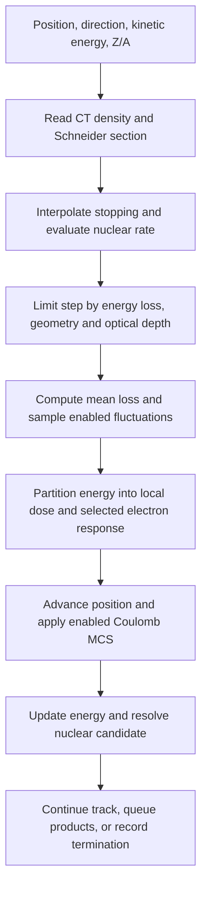
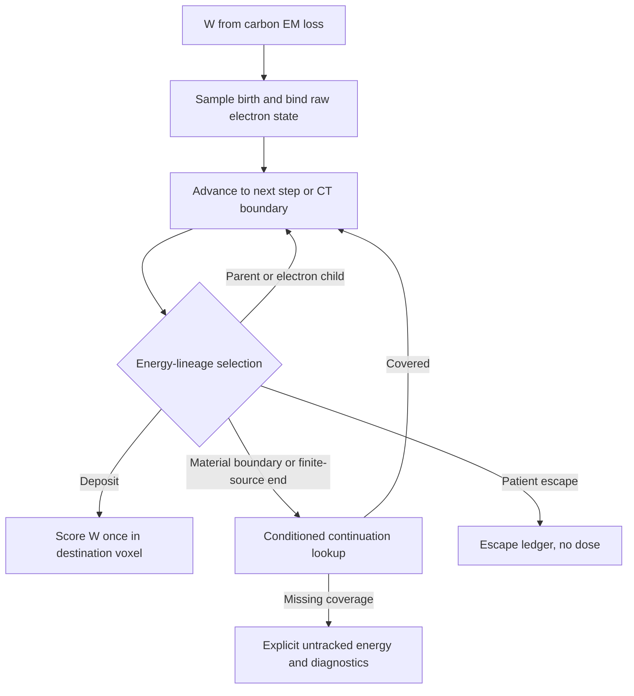

# Materials and Methods

Revision: 2026-09-10. Current research draft, not a clinical or general Geant4-equivalence claim.
[中文](mm_zh.md). The [physics specification](docs/TOPAS_GPU_Physics_Model.md) describes the September 5 baseline;
subsequent implementation changes are identified below and checked against source code.
Original drafts, including exploratory proton/multi-ion material,
are preserved in the [archive](docs/archive/README.md), not promoted to validated CT capabilities.

This revision reviews the source/build graph, configuration and data loaders, TOPAS
extraction tools, tests, benchmark artifacts and research plans through source checkpoint
`f6245c5` (2026-09-09). Existing uncommitted transport changes are not a frozen release.
Unless explicitly labelled otherwise, numerical CT results and benchmark settings below
refer to the Git-tracked September 5 dataset, not to every current code path.

## 1. Computational framework and reference

MAIGO is a C++20/SYCL condensed-history charged-ion Monte Carlo.
The patient backend is [transport_sycl.cpp](src/transport_sycl.cpp); the serial backend is a subset.
This benchmark uses a local NVIDIA RTX 2080 Ti (sm_75).
The GPU interpolates transport tables and replays correlated nuclear final states without
running Geant4 or an intranuclear cascade generator.

Reference: TOPAS 4.2.p3 / Geant4 11.3.2 with g4em-standard_opt4,
g4h-phy_QGSP_BIC_HP, g4decay, g4ion-inclxx, g4h-elastic_HP, g4stopping,
g4radioactivedecay. Module names do not identify the active model for every projectile.
Reference C12 was observed to use INCLXX; BIC in the list does not establish a C12
BIC-versus-INCLXX discrepancy.

Counter-based streams index histories and process channels. Reproducibility requires
the frozen executable, inputs, seeds and allocations, not an assumption of bitwise
equivalence across devices/builds.

## 2. Materials, source and geometry

HU maps to continuous density and one of 25 Schneider sections with 13-element compositions.
Composition is a shared LUT, not copied into each voxel. Probe-material representative
densities must not replace actual CT densities. CCTG/DICOM and scorer geometry are checked together.

Current source generation uses TPS spot CSV histories, beam-model emittance, energy spread,
virtual scanning magnets and explicit TOPAS placement. Each replica's integer spot histories
are matched before GPU sharding. TOPAS passive RotZ gives component world-to-patient coordinates
R(+RotZ) × (world − Trans); vectors rotate without translation.
Source, placement and CT packing are separate operations. Dose is restored to patient coordinates
using the frozen mapping, without dose-fitted registration. See [planning](docs/planning.md).

Current homogeneous-water runs share the CINEL03 nuclear transport framework with CT,
using native, SHA-pinned G4_WATER composition and H/O elemental rates reconstructed
from the material partial-rate tables. Water is not assigned a fictitious Schneider section.
Its stopping, density, radiation length and fluctuation inputs remain material-specific;
CT tables do not silently replace them. Legacy CINEL02 event/rate configuration keys
are rejected by the unified-water route. Allowing water `run_mode: production` does not
establish TOPAS accuracy: run quality retains an explicit incomplete-validation note.
See the [unification record](plan2/water_ct_unification.md) and
[material rate interface](include/carbon/material_nuclear_rates.hpp).

## 3. Electromagnetic transport

### 3.1. What happens in one charged-particle step?



The diagram summarizes the main data dependencies; geometry face handling and diagnostic
branches are interleaved in the kernel. C12 and charged fragments undergo condensed-history
transport: microscopic ionizations are represented by a step energy loss and scattering law.
The GPU does not invoke a Geant4 electromagnetic process manager for every collision.

Symbols used below: T is total particle kinetic energy in MeV, E=T/A is MeV/u,
rho is local density in g/cm³, and h is step length in mm. Quantities tabulated per
nucleon must not be confused with total particle energies used for energy conservation.

### 3.2. Primary and secondary predictor-midpoint energy loss

The current repair uses an explicit final configuration:
`ct_primary_midpoint_stopping: true`, `ct_secondary_exact_faces: true`, and a
SHA-pinned Schneider secondary-ion material table. Validation of this combination
is recorded separately; historical frozen results do not validate it. Old configurations
without the material bank retain their previous route, so the executable version alone
does not identify the physics configuration.

Queries use kinetic energy per nucleon E=T/A. Primary C12 uses the validated SCHNSTOP
section table. Secondaries select directly extracted TOPAS/Geant4 electronic stopping
by (Z,A) and Schneider section. The new bank covers 25 sections, 18 charged species and
0.01–6000.11 MeV/u. Its range extends beyond the primary grid because secondary protons
can exceed 430.11 MeV/u. The 18 stopping species and 14 nuclear projectiles serve different purposes.

Both tables store linear stopping divided by the extraction material's reference density:

```text
S1(s,ion,E) = S_TOPAS(s,ion,E,rho_ref) / [rho_ref/(1 g/cm³)]
S(T,s,rho) [MeV/mm] = S1(s,ion,T/A) × rho/(1 g/cm³)
```

Local density scaling therefore does not count density twice. Material composition is
already represented by the section row. In the final configuration, both secondary
step-start and midpoint queries use that material bank without an extra Bethe factor.
Invalid species, section, energy or density rejects the run; no water fallback or failed-dose merge is allowed.

```text
S_start = S(T,s,rho)
h_loss = maximum_relative_energy_loss × T / S_start
h <= min(maximum_step_mm, h_loss, geometry, nuclear collision and termination distances)
T_mid = T - S_start × h/2
mean loss = S(T_mid,s,rho) × h (subsequently bounded by available kinetic energy)
```

The frozen maximum step remains 0.5 mm. The h_loss limiter and 0.005 relative-loss
limit above apply to primaries. Secondary steps use the maximum length, geometry and
nuclear collision truncation without the same relative-loss step limiter; their midpoint
loss is bounded by remaining kinetic energy. The primary midpoint query interpolates within
the primary table domain; the secondary predicted midpoint has a 0.01 MeV/u floor.
Exact face truncation prevents a secondary step from using the starting material across
a material boundary. The mean loss then enters fluctuation and electron-energy sharing;
the predicted midpoint is not the transported end-state energy. Upstream air loss is separate.

Implementation: [loader and stepping](src/transport_sycl.cpp),
[material table and query domain](include/carbon/schneider_ion_stopping_table.hpp),
[configuration switches](include/carbon/transport_config.hpp).

### 3.3. Energy-loss fluctuations

The mean loss defines the energy budget; the selected straggling sampler produces a
nonnegative realization bounded by the available T. Primary transport offers an analytic
condensed-loss variance path and separately selected TOPAS fluctuation-quantile packages.
The analytic variance depends on effective charge, density, step length and relativistic
maximum electron transfer. For the clamped Gaussian sampler:

```text
sigma = configured_scale × sqrt(condensed_loss_variance)
DeltaE = clamp(mean_loss + sigma × N(0,1), 0, min(2×mean_loss, T))
```

Other selectable samplers have their own positive-support/moment approximations; this
formula must not be attributed to every sampler. A packaged fluctuation mode samples
an energy-loss ratio from its declared energy/thickness or fractional-loss grid and applies
it to the mean loss. Domain checks and candidate restrictions remain part of that mode.
A table of fluctuations is not an electron spatial-response package.

The frozen CT settings enable primary straggling with scale 1.2 and disable secondary
straggling. Neither a selectable Vavilov/Landau-related mode nor the presence of a TOPAS
package proves exact reproduction of Geant4's ion fluctuation algorithm.
See [samplers](include/carbon/straggling.hpp) and [package loader](src/energy_loss_fluctuation.cpp).

### 3.4. Coulomb multiple scattering

The benchmark uses Highland MCS with section X0 and local density for both primary and
secondary tracks, not the exact Geant4 msc algorithm.

The implemented projected RMS angle uses the particle momentum p and beta:

```text
t = rho × (h/10) / X0_mass
C = max(0, 1 + 0.038 ln(t Z²/beta²))
theta0 = 13.6 MeV × Z/(beta p c) × sqrt(t) × C
```

Random deflections are generated in a local transverse frame and rotated into the
current direction; transport updates the direction and the associated spatial scattering
according to the selected branch. For CT, X0_mass comes from the 25-section LUT and rho
from the actual voxel. This Coulomb deflection is distinct from an explicit hadronic
elastic collision. Water/FRED-2GR options are separate configurations, not the frozen
CT Highland model. See [MCS definitions](include/carbon/multiple_scattering.hpp) and
[GPU arithmetic](src/detail/sycl_device_math.inc).

## 4. Inelastic nuclear interactions

**MAIGO: sample the collision, then replay a TOPAS-derived correlated event.**

1. **Locate the collision.** The local macroscopic rate is `Sigma = rho × sum(elemental mass-rate partials)`.
   Primary C12 consumes a sampled optical depth `tau = -ln(U)` along its path;
   the remaining optical depth determines the collision distance. Supported secondary
   ions use their own projectile-dependent rates. A mean free path is a statistical
   scale, not a fixed collision distance.
2. **Select the target and event.** Choose the target element according to its partial
   rate. At the post-EM energy, select one of the two bracketing energy nodes and
   sample a complete CINEL03 event. Retain the correlated product energies and angles;
   rotate the event into the incident frame with one shared random azimuth.
3. **Transport the products.** Replace the incident track with the sampled final state.
   Supported charged fragments enter GPU queues for electromagnetic transport and
   eligible further inelastic reactions. Unsupported channels, energy cutoffs and
   generation limits have explicit accounting; queue overflow invalidates the run.

The current minimum is the pinned Schneider v2.1 stack with a 14-projectile secondary
nuclear registry. Missing channels are not replaced by a nearby target, and product
energies are not globally rescaled. If no valid target remains after EM loss, a null
candidate continues with its remaining energy instead of replaying or depositing it locally.
The frozen generation setting is 2; He6/B8/C10 follow the declared EM-only nuclear policy.

**Difference from TOPAS**

| Aspect | MAIGO | TOPAS / Geant4 reference |
|---|---|---|
| Collision probability | Interpolated extracted elemental rate tables with explicit validity domains | Cross-section datasets and process tracking of the configured physics list |
| Nuclear final state | Samples a finite bank of precomputed correlated events at discrete energy nodes | Invokes the applicable nuclear model at the interaction state to generate products |
| Model execution | No online intranuclear cascade calculation | Reference C12 was observed to invoke INCLXX; the active model depends on projectile and energy |
| Subsequent transport | Supported charged species and bounded nuclear generations; neutral/decay scope is limited | Transports products using the enabled particle processes and tracking cuts |

Reusing TOPAS-derived events preserves the sampled event correlations and avoids online
nuclear-model computation. It does not make the two engines identical: finite event
statistics, energy-node sampling, stepping and secondary coverage remain differences.
The shared event-azimuth rotation was added after the September 5 frozen benchmark.
See [CINEL03 lookup](include/carbon/inelastic_package_v3.hpp) and
[GPU transport](src/transport_sycl.cpp).

## 5. Elastic nuclear interactions

**Available in research configurations for Schneider CT and unified water:** all 18
supported charged species, including primary C12, against all 13 Schneider target
elements. Existing default production configurations still omit this process while
matched-reference validation is in progress. Coulomb MCS remains a separate EM process.

1. **Locate the collision.** Primary C12 consumes sampled nuclear optical depth using
   the sum of elastic and inelastic macroscopic rates, then selects the reaction type
   by their relative rates. Secondary elastic and inelastic collision distances compete;
   elastic remains active beyond the nonelastic generation limit. Geometry, EM loss and
   energy cutoff can shorten the step before either collision.
2. **Sample the target and transfer.** Select the element by its material-specific
   partial rate and the neighboring energy node by rate-weighted interpolation. A joint
   TOPAS sample provides the target isotope, its nuclear mass and `t/tmax`. The current
   energy and a random azimuth determine the relativistic two-body final state. This
   preserves energy and momentum rather than assuming isotropic scattering for every target.
3. **Transport the recoil.** Recoils within the existing 18-species registry enter normal
   charged transport. Additional natural target isotopes use a 37-isotope material-specific
   total-stopping table and MCS, without subsequent explicit nuclear reactions. That total
   stopping includes condensed nuclear stopping. Below-cutoff residual energy deposits locally;
   queue overflow or missing required data rejects the run.

| Aspect | GPU research implementation | Matched TOPAS reference |
|---|---|---|
| Elastic rate and final state | Finite, material-specific rate tables and isotope/transfer samples | Online Geant4 cross-section and final-state model evaluation |
| Models represented | p: hElasticCHIPS; d/t/He3/alpha: hElasticLHEP; other supported ions: NNDiffuseElastic | Same attached elastic models, with `CarbonIonElasticPhysics` enabled |
| Recoil coverage | Existing 18 species plus EM-only additional target recoils | Applicable processes for the generated particles |
| Coulomb scattering | Condensed Highland treatment | Configured Geant4 EM processes |

**Why new TOPAS references are necessary.** The historical `topas10x` physics list had
elastic processes for p, d, t, He3 and alpha, but not GenericIon/C12. Adding
`CarbonIonElasticPhysics` enables the missing ion elastic process. The matched reruns
retain the previous EM, inelastic, stopping and decay modules, patient geometry, source,
3D dose grid and total histories; LET scorers are omitted for this dose validation.

The baseline bank has 137 energy nodes and 512 samples per projectile/target/node.
Tests cover relativistic kinematics, host/device lookup, water closure and a 6,481,909-history
RT07575 shard with zero overflow. Independent 2048-sample and denser-grid banks also pass
shard closure, but low-energy cross-section onset interpolation, additional recoil
contributions and full-statistics matched dose validation remain open. These checks do
not yet establish production acceptance.

Use [CT research configuration](config/rt07575_elastic_research.yaml) or
[water research configuration](config/unified_water_elastic_research.yaml); the legacy
`enable_nuclear_elastic` switch is not the activation method for this path. New elastic
packages are not included in Release 11.3.2. See [implementation and data](docs/all_ion_elastic.md),
[validation evidence](evidence/step-31/elastic-production-validation-20260911/README.md) and
[September 12 reference migration](evidence/step-31/elastic-migration-20260912/README.md).

## 6. Electron tracking and energy deposition

### 6.0. What the current CT calculation actually runs

The September 11 final-stopping lung calculation (primary midpoint ON, secondary
material stopping ON, secondary exact-faces ON) uses **continuous ion energy loss plus
the section-0 transverse delta-tail response**. It does not create and advance an
individual track for every ionization electron. Changing the ion stopping table does
not automatically enable a different electron transport model.

| Configuration / response | State in that calculation | Meaning |
|---|---|---|
| `ct_schneider_delta_tail_file` | Pinned section-0 table enabled | Redistributes a fraction of primary C12 loss transversely |
| `material_electron_response_index_file` | Empty | No material electron packet replay |
| `ct_electron_joint_response_diagnostic_file` | Unset | No joint longitudinal/radial response |
| `ct_electron_segment_transport` | `false` | No ordered joint-path replay |
| `ct_schneider_delta_longitudinal_file` | Unset | No longitudinal supplement |
| `enable_electron_transport` | Default `false` | No explicit-electron mode; its configuration validation rejects CT |

The loss computed from stopping, after any enabled fluctuation, supplies the energy
budget. The ordinary charged-ion scoring path deposits that budget without resolving
the individual electron collisions. The enabled tail response moves some of the primary
budget to another scoring location; it does not subtract extra kinetic energy from the
carbon. This section-0 response is called in the primary branch, not in the secondary-ion
loop. Secondary material-specific stopping therefore does not imply that secondary-born
electron families are tracked using the material response bank.

The separate `ElectronTransportTable` contains electron/positron collisional, radiative,
total stopping and CSDA ranges. The presence of those tables and an explicit-electron
configuration key is not evidence of active CT electron tracking. The configuration
validator limits that key to homogeneous water and excludes the serial backend.
See [configuration validation](src/config.cpp), [GPU branches](src/transport_sycl.cpp),
and [electron stopping table](include/carbon/electron_transport.hpp).

### 6.1. Three different meanings of “electron package”

| Object | Stored information | Runtime role / validation scope |
|---|---|---|
| Frozen section-0 transverse delta-tail | Moved fraction and transverse response versus C12 energy | Narrow dose redistribution used in September 5 CT |
| Joint / ordered response candidate | Correlated longitudinal–radial response or ordered full-family paths | Independent experimental branch |
| Material electron response bank | Birth samples, raw states/segments, child links and continuation indices | Energy-packet replay candidate; not accepted physics |

These objects are not CINEL03 nuclear final-state packages. They alter where an already
budgeted electromagnetic loss is scored, rather than introducing an additional carbon
energy loss on top of stopping.

### 6.2. Frozen transverse response

The strict-dose stack includes a TOPAS-derived transverse redistribution of part of primary
C12 loss in section 0, extracted at 150/200/225 MeV/u. Runtime processing is:

1. **Check the source.** The primary step must be inside a section-0 voxel, with an
   aligned 3D scorer and an eligible source-mask entry. The mask examines existing
   face neighbours along axes with the minimum CT spacing; these neighbours must
   also be section 0. Grid edges alone are not treated as material interfaces.
2. **Sample the response.** Query the table at the current C12 energy for a moved
   fraction and sampled radius. Form `W = DeltaE × clamp(f_tail, 0, 0.5)` and sample
   one uniform azimuth. The source point is the midpoint of the carbon step.
3. **Place the endpoint.** Rotate the sampled transverse displacement into the frame
   perpendicular to the current carbon direction:
   `x_target = x_mid + r × (cos(phi) e1 + sin(phi) e2)`.
   Longitudinal displacement relative to that midpoint is zero. For an oblique beam,
   the endpoint can nevertheless have a different world z coordinate.
4. **Assign energy once.** Apply the destination rules below. This is endpoint
   redistribution: no electron momentum, scattering history or intervening material
   sequence is propagated along this transverse displacement.

| Sampled destination | Dose and energy accounting |
|---|---|
| Inside the scorer and section 0 | Subtract W from local loss and score W in the destination 3D voxel |
| Outside the scorer | Subtract W locally and record scorer escape; do not fold it into an edge voxel |
| Inside the scorer but another section | Retain W locally and increment the unsupported-destination counter |
| Source ineligible, or sampled fraction/radius not positive | Keep the loss on the ordinary local scoring path |

The moved, retained-on-unsupported-destination and escaped energies have separate
counters. A destination in section 0 does not prove the entire displacement stayed in
section 0; this model does not solve general air/tissue electron boundary transport.
The accounting is `DeltaE = local remainder + relocated dose + scorer escape`, with
the unsupported-destination amount already included in the local remainder.

A joint candidate instead uses correlated longitudinal/radial coordinates; independently
sampling their marginals would discard the measured correlation.

The September 5 three-case executable includes the entrance-mask candidate. Later
longitudinal, joint and ordered full-family response implementations are separate
experiments; that benchmark does not validate them. Ordered replay preserves the
recorded path and ancestry rather than replacing a trajectory by its endpoint chord.

### 6.3. Optional material packet tracking: extraction and loading

The TOPAS [electron scorer](startup/extensions/CarbonElectronDepositNtupleV3.hh) records
run/event/track/parent identity, pre/post KE, deposited energy, positions and material/density.
Its transport-state extension also records actual momentum directions, physical step length,
status and post-material information. A chord direction is not substituted for momentum.
The generating C12 step is bound explicitly; descendants inherit their family association
through the offline genealogy rather than being counted as new independent C12 births.

Offline tools build material dictionaries, birth channels, ordered state arrays, child-link
indices and continuation lookup structures. Source hashes, schema, material identity,
energy coverage and memory budgets are checked at loading. Recorded finite-box escape
is an extraction boundary condition, not automatically an escape from the patient.
See [state compiler](tools/compile_electron_state_catalog.py) and
[segment compiler](tools/compile_water_electron_segments.py).

A further material-response candidate loads SHA-pinned birth distributions, raw electron
segments and continuation indices for water or Schneider CT. It transports an energy-valued
statistical packet W, distinct from the sampled electron kinetic energy. Each packet has
one terminal energy owner: deposit, patient/scorer escape or explicitly uncovered energy.
Finite source exhaustion requests continuation; it is not patient escape. Missing photon
continuation is reported separately and is not deposited locally. Same-section density
interpolation mixes measured conditional distributions; full density and interface accuracy
remain unvalidated. Electron birth material and boundary traversal must use consistent
voxel ownership. The runtime supports device-resident or host-mapped response banks
with explicit memory budgets.

### 6.4. Birth selection and the packet energy budget

For a valid material-response query in the primary C12 CT branch, the code samples a
birth point along the carbon step and obtains the movable fraction f from the response:

```text
W = f × DeltaE_C12
local carbon deposit = DeltaE_C12 - W
carbon KE after EM = carbon KE before EM - DeltaE_C12
```

W is a statistical energy weight, not a new electron's sampled kinetic energy. Replaying
it does not slow the carbon a second time. For two density nodes in the same section,
w=(rho-rho0)/(rho1-rho0), the fraction is (1-w)f0+w f1; birth-table selection is weighted
by these fractional energy contributions. Continuation has its own conditional sampler.
No crossing to another section is hidden by a nearest-material alias, and no unvalidated
1/rho trajectory rescaling is implied by the interpolation formula.

### 6.5. Follow one energy lineage through the recorded family

At a complete recorded electron step, the raw physical state must satisfy:

```text
T_in = dE_local + T_parent,out + sum(T_children)
P(deposit) = dE_local/T_in
P(parent continuation) = T_parent,out/T_in
P(child j) = T_child,j/T_in
```

The algorithm selects one of these energy-proportional branches and carries the same W
along it. It does not clone W into all children. If deposition is selected, W is scored at
the sampled location of that segment; otherwise the cursor follows the parent or selected
child. This is an estimator of the energy distribution through the family, not a one-to-one
simulation of every physical electron. Its stochastic variance and accuracy need independent
validation. Raw genealogy and closure are checked before the branch is selected.
See [energy-lineage selection](include/carbon/electron_energy_lineage.hpp).



### 6.6. Interfaces, missing coverage and terminal ownership

At a CT interface the cursor is clipped to the boundary and the next material/density
selects a compatible continuation; two air endpoints do not justify crossing tissue using
an air path. At source exhaustion, positive remaining KE requires continuation sampling.
An optional short-range shortcut can terminate a packet at its birth point only after
a containment check; it belongs to the material candidate and is inactive in the CT
calculation described in Section 6.0.
Missing photon continuation is a separate uncovered-energy sink; it is not a local deposit
or patient escape. Invalid geometry, unresolved electrons and an exhausted iteration cap
retain explicit failure accounting. A rejected birth query is not silently treated as normal
local stopping dose.

For each parent loss, the accounting objective is:

```text
DeltaE_C12 = retained local energy + packet energy deposited in scorer
          + packet energy outside scorer / physically escaped
          + explicitly untracked packet energy
```

These are mutually exclusive energy owners; diagnostic subcategories must not be added
again to totals that already contain them. Energy closure verifies accounting, not the
correctness of the spatial response.

### 6.7. Activation and validation boundary

The material candidate is mutually exclusive with the older delta-tail, joint and explicit
electron modes and requires 3D scoring with LET disabled. Run quality still reports
`unvalidated_material_electron_response`; closure alone cannot remove this failure.
See [packet transport](include/carbon/electron_packet_transport.hpp),
[density sampling](include/carbon/material_electron_density.hpp) and
[quality gates](src/run_quality.cpp). General density/geometry/birth conditioning and
promotion gates remain under [plan2](plan2/README.md).

## 7. Scoring and quality

Dose(Gy) = Edep(MeV) × 1.602176634e−13 / mass(kg), with
mass = density(g/cm3) × volume(mm3) × 1e−6.
Output is cumulative 3D DoseToMedium. IDD is derived by transverse summation, not a 1D scorer;
isocenter profiles are interpolated lines, not IDD.

Optional LET_d = sum(L × dE)/sum(dE); shards merge both moments before division.
LET is disabled in this three-case dose benchmark, which supplies no new LET validation.
Origin-dose outputs are diagnostics, not independent TOPAS species references.

Checks include finite outputs, exact particle/candidate accounting, zero overflow,
data provenance and energy closure. Explicit sinks check deposited = in-grid + outside-grid
and voxel sum = in-grid with implemented relative tolerance 1e−3.
Global closure is not exact nuclear mass/Q closure at every vertex.
See [scoring contract](docs/scoring_validation.md) for fields and compatibility conditions.

## 8. Evaluation and limitations

The 2026-09-05 dataset has 60 accepted shards, 457,898,870 histories and zero overflow.
Numerical results reside in the [current index](docs/results.md) and frozen artifacts.

Evaluation uses nominal cumulative Gy without LS scaling or fitted registration.
The mask includes every reference voxel ≥10% of whole-volume Dmax, with no BODY mask.
Global tolerances use Dmax; local tolerances use the reference voxel dose.
Criteria: 3%/3mm, 2%/2mm, 1%/1mm, 3%/0mm.
Nonzero distances use a 0.5 mm spherical lattice and trilinear interpolation,
not an analytic continuous minimum; 3%/0mm compares the same voxel.

Results apply only to frozen inputs/executable. Strict local and low-density/interface
residuals remain; neither a unique electron cause nor full physics equivalence is established.
This benchmark does not close plan2, upgrade packages or establish clinical readiness.

## 9. Later evaluation and performance work

The local, untracked report `benchmark/topas10x/gpu_current_20260909.md` records a later
60-shard three-case run, refined Gamma and an experimental RT07575 electron full20 A/B.
These local artifacts are not supplied by this two-file documentation update and are not
a replacement for the published September 5 evidence. Their experimental electron
results do not promote the minimum physics stack; reproduction requires the corresponding
executable, configuration, raw-dose hashes and quality reports.

The later `tools/evaluate_gamma_adaptive.py` tool (source checkpoint `f6245c5`) first
reproduces the frozen 0.5 mm pass mask, then searches only failures on a 0.25 mm lattice
using the same trilinear interpolant. Coarse passes are retained, and 3%/0mm is unchanged.
It checks dose hashes/history counts and writes a separate `gamma_refined.json` without
overwriting the frozen result. Refined and coarse rates must be labelled separately:
search refinement changes numerical evaluation, not transported dose. Neither finite
lattice is an exact continuous minimum. The tool is a later local commit, not part of
this documentation-only publication.

Performance reporting separates primary-plus-secondary GPU kernel time, the program's
transport elapsed time, and complete process wall time including response loading and I/O.
Histories/s must identify its denominator, statistics, chunk size, scorer settings and
hardware; a small smoke test cannot establish full-plan acceleration against TOPAS.

The [tracked 64-history short-range comparison](benchmark/benchmark20260909/short_range_64_comparison/README.md)
uses patient 20022516 and thresholds 0, 0.1 and 0.25 mm. Raw dose is bitwise equal,
overflow is zero, but all runs remain rejected for unvalidated material response.
Primary kernel times are 61.2625, 61.5884 and 61.5946 s: no speedup was demonstrated.
The shortcut requires a complete childless terminal tail contained in the current voxel;
the default threshold is zero. The later cached-tail implementation remains a candidate,
not an accepted performance result.

## 10. Reproduction and validation procedure

Build settings are specified by [CMake](CMakeLists.txt) and [presets](CMakePresets.json):
C++20, SYCL enabled, NVIDIA target `nvptx64-nvidia-cuda`, local `sm_75`.
Freeze executable SHA, parsed configuration, source/CT transforms, all data pins,
spot allocations, seeds, scorer options and shard manifests. Run
`python3 tools/verify_schneider_v2_1_data.py` before every Schneider CT campaign;
missing files, hash/size/schema mismatch or incomplete 14-projectile coverage are hard failures.
Large binaries and external raw responses are not guaranteed to be present in a fresh clone.

GPU work runs only on the local RTX 2080 Ti. TOPAS extraction uses local `sbatch`,
raw data under `/mnt/sda/wuwei`, and source/build/extensions under `/home/wuwei/topas`.
All jobs together are limited to 192 CPU threads and 160 GB memory, allocated by workload.
Split large GPU history sets; any secondary overflow requires smaller shards and reruns.
Merge only individually acceptable shards and verify aggregate energy and history accounting.

Data promotion requires explicit TOPAS/Geant4 provenance, manifest and host/device lookup
checks, 50k closure gates, paired one-shard Gamma, and zero-overflow full validation.
Independent phantom/domain/geometry tests are also required for electron candidates.
Historical test fixtures and old documentation are not evidence that current tests passed;
this methods update itself runs no new transport or physical-accuracy validation.

## References and traceability

- [FRED paper interpretation / source pointers](docs/FRED_Carbon_Fragmentation_Model.md)
- [Physics specification](docs/TOPAS_GPU_Physics_Model.md) and [code map](docs/structure.md)
- [Frozen benchmark and provenance](benchmark/topas10x/gpu_current_20260905.md)
