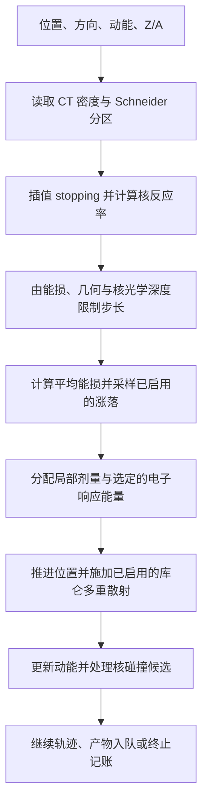
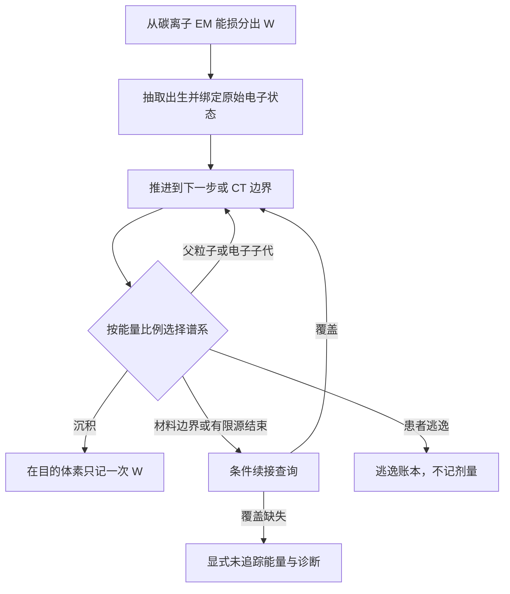

# 材料与方法

修订日期：2026-09-10。当前科研方法稿，不声明临床准入或通用 Geant4 等价。
[English](mm.md)。[物理规格](docs/TOPAS_GPU_Physics_Model.md) 描述 9 月 5 日基线；
后续实现变化在下文单列，并与源码核对。
旧稿的质子/多离子探索完整保留在 [归档](docs/archive/README.md)，不提升为已验证 CT 能力。

本次核对源码与构建图、配置及数据加载、TOPAS 提取工具、测试、benchmark 产物和研究计划，
源码检查点为 `f6245c5`（2026-09-09）。已有未提交输运修改不属于冻结发布版本。
除非另行标注，下文 CT 数值和 benchmark 配置均指 Git 中的 9 月 5 日数据集，
不代表当前全部代码路径。

## 1. 计算框架与参考

MAIGO 使用 C++20 / SYCL 实现带电离子凝聚历史 Monte Carlo。
患者后端为 [transport_sycl.cpp](src/transport_sycl.cpp)，串行后端仅支持子集。
本批使用本地 NVIDIA RTX 2080 Ti（sm_75）。
GPU 插值输运表并重放相关核末态，不在运行时调用 Geant4 或核级联生成器。

参考为 TOPAS 4.2.p3 / Geant4 11.3.2，模块：
g4em-standard_opt4、g4h-phy_QGSP_BIC_HP、g4decay、g4ion-inclxx、
g4h-elastic_HP、g4stopping、g4radioactivedecay。
模块名不能证明每种粒子的实际模型；参考 C12 已观察到调用 INCLXX，
不能因 list 含 BIC 就解释成 C12 BIC 与 INCLXX 的差异。

随机流按历史和过程通道索引。复现绑定 executable、输入、seed 和分配，
不保证跨设备/构建逐位一致。

## 2. 材料、源与几何

HU 映射为连续密度和 25 个 Schneider section，组成含 13 元素。
组成用共享 LUT，不复制到每体素；不能用材料探针代表密度替代 CT 实际密度。
CCTG/DICOM 与记分几何共同核对。

当前源采用 TPS spots CSV histories、beam-model emittance、能散、
虚拟扫描磁铁和显式 TOPAS placement。匹配每个 replica 的逐 spot 整数 histories，
再分配 GPU shards。TOPAS 被动 RotZ 的 world→patient 组件局部坐标为
R(+RotZ) × (world − Trans)，方向只旋转不平移。
source、placement、CT packing 是三个操作；按冻结映射恢复患者剂量，
不做剂量拟合配准。见 [planning](docs/planning.md)。

当前均匀水模与 CT 共用 CINEL03 核输运框架，使用 SHA 固定的原生 G4_WATER 组成，
并从材料 partial-rate 表恢复 H/O 元素反应率；不伪造 Schneider 水分区。
水的 stopping、密度、辐射长度和涨落输入仍按自身材料定义，不能静默换成 CT 表。
统一水路由拒绝旧 CINEL02 event/rate 配置键。允许水模 `run_mode: production`
不等于 TOPAS 精度已验收，质量报告仍明确记录验证未完成。
见 [统一框架记录](plan2/water_ct_unification.md) 与
[材料反应率接口](include/carbon/material_nuclear_rates.hpp)。

## 3. 电磁输运

### 3.1. 一个带电粒子步内发生什么？



图中展示主数据依赖；实际 kernel 中穿插体素面处理与诊断分支。
C12 和带电碎片采用凝聚历史输运：微观电离由一步能损及散射规律表示，
GPU 不逐碰撞调用 Geant4 电磁过程管理器。

下文 T 为粒子总动能（MeV），E=T/A 为每核子动能（MeV/u），
rho 为局部密度（g/cm³），h 为步长（mm）。查表用的每核子能量不能与能量守恒中的总动能混淆。

### 3.2. 原发与次级 stopping 是不同路径

步长受最大长度、相对能损、几何、核光学深度与终止条件约束。
三病例冻结上限为 0.5 mm 和 0.005。
Primary C12 使用 Schneider mass stopping/range 及局部密度；
默认精确 Schneider CT 路径的次级使用 water-ion stopping 并按局部密度缩放。
分区材料因子仅在下述显式诊断路径开启时施加，不属于默认计算；
这不是直接提取的完整 isotope×section stopping 数据集。
Upstream air 能损独立处理。

对 CT 中的原发 C12，在 SCHNSTOP 对应分区行按能量线性插值，得到单位密度下的
线性阻止本领 S1(s,E)。实际换算为：

```text
S_C12(s,E,rho) [MeV/mm] = S1(s,E) × rho / (1 g/cm³)
h_loss = maximum_relative_energy_loss × T / S_C12
h <= min(maximum_step_mm, h_loss, 适用的几何边界与碰撞距离)
```

二进制表已经包含自身单位约定，运行时不能再额外乘除十。
默认精确 Schneider 原发分支取平均能损 S_C12(T)×h。
独立的 `ct_primary_midpoint_stopping_diagnostic` 默认关闭，开启才使用预测中点 stopping；
其他 water/CSDA 分支不能被描述成默认 CT 积分器。

带电碎片从 `data/ion_stopping_power_water_geant4_11_3_2.csv` 选择对应物种行，
按 E=T/A 插值。CT 加载器直接使用该水中离子表，填写另一条通用 particle stopping
路径不会自动获得完整 CT 同位素表。次级计算为：

```text
S_secondary(T,s,rho) = S_water,ion(T/A) × rho/(1 g/cm³) × F(s,T/A)
默认精确 Schneider CT：F = 1
显式 ct_secondary_schneider_sp_diagnostic：F = Schneider Z/A、I 的 Bethe 材料因子
T_mid = max(0.01×A MeV, T - S_secondary(T)×h/2)
次级平均能损 = min(S_secondary(T_mid)×h, T)
```

步首和中点都应用相同的密度/材料策略。诊断根据 25 分区的组成 Z/A 与平均激发能 I
构造因子，并没有逐同位素重新提取材料 stopping。
LUT 仅在 `use_ct_mass_sp && (!use_schneider_stopping || ct_secondary_schneider_sp_diagnostic)`
成立时加载。精确原发 stopping 开启且诊断关闭时，次级材料因子 LUT 不存在。
带电 stopping 的 18 行 lookup 与核反应的 14-projectile registry 用途不同，不能视为同一覆盖清单。

代码：[加载与步进](src/transport_sycl.cpp)、[次级缩放函数](include/carbon/ct_grid.hpp)、
[默认开关](include/carbon/transport_config.hpp)。

### 3.3. 能损涨落

平均能损提供能量预算；选定的 straggling sampler 产生非负且不超过可用 T 的实际能损。
原发输运提供解析凝聚能损方差路径，以及独立选择的 TOPAS 涨落分位数包。
解析方差与有效电荷、密度、步长和相对论最大电子转移能有关。
对截断高斯采样器：

```text
sigma = configured_scale × sqrt(condensed_loss_variance)
DeltaE = clamp(mean_loss + sigma × N(0,1), 0, min(2×mean_loss, T))
```

其他可选采样器采用各自的正支撑/矩近似，不能统一套用这个公式。
包模式按声明的能量、面密度或相对能损网格抽取能损比，再作用于平均能损；
域检查和候选限制仍然有效。涨落表不等于电子空间响应包。

冻结 CT 配置开启原发涨落、scale=1.2，关闭次级涨落。
可选 Vavilov/Landau 相关模式或 TOPAS 数据包的存在，不证明精确复现 Geant4 离子涨落算法。
见 [采样器](include/carbon/straggling.hpp) 与 [涨落包加载](src/energy_loss_fluctuation.cpp)。

### 3.4. 库仑多重散射

本批 primary/secondary 都用 section X0 与局部密度的 Highland MCS，
不是 Geant4 msc 算法复刻。

实现中的投影 RMS 散射角使用粒子动量 p 和 beta：

```text
t = rho × (h/10) / X0_mass
C = max(0, 1 + 0.038 ln(t Z²/beta²))
theta0 = 13.6 MeV × Z/(beta p c) × sqrt(t) × C
```

在局部横向坐标系抽取偏转，再旋转到当前入射方向；所选输运分支更新方向及相应空间散射。
CT 的 X0_mass 来自 25 分区 LUT，rho 来自实际体素。
这里的库仑偏转不同于一次显式强子弹性碰撞。
Water/FRED-2GR 是独立配置，不是冻结 CT 的 Highland 模型。
见 [MCS 定义](include/carbon/multiple_scattering.hpp) 与 [GPU 计算](src/detail/sycl_device_math.inc)。

## 4. 核重放与次级范围

### 4.1. 离线提取与在线输运各做什么？

```text
TOPAS/Geant4 提取
  → 按 projectile/target 分解的反应率 + 相关末态事件
  → 编译、来源审计与二进制 schema 检查
  → 固定版本的反应率表和 CINPKG04 事件包
GPU 运行
  → 根据反应率决定碰撞位置
  → 选择靶元素、能量节点与事件
  → 整体旋转事件并输运已支持的带电产物
```

反应率回答“多久发生、打在哪种靶上”，事件库回答“产生哪些相关产物”。
重放事件不能替代反应率计算；总反应率正确也不自动证明碎片能谱和角分布正确。

### 4.2. 碰撞位置与元素靶选择

最低数据栈为 Schneider v2.1：SCHNRATE/SCHN2RAT v3 rates、
CINPKG04 v4 primary 和 14-projectile secondary 包、SCHNSTOP v1。
哈希由 [AGENTS](AGENTS.md) 和 [manifest](data/schneider/v2_1_data_manifest.json) 固定。

Hazard 为局部密度乘有效元素 partial-rate 总和，查询时按通道域 mask。
Lookup 精确匹配 projectile Z/A 和 target Z。
有效 bracket 上节点概率为 (Eq−E0)/(E1−E0)，非精确节点 gap >5 MeV/u 拒绝。
节点内抽取完整相关事件、保留能量，方向旋转到入射系；
无近邻靶 alias，无整体产物 KE 缩放。

9 月 7 日起，primary 和 secondary CINEL03 replay 对每个事件抽取一个绕入射轴的
均匀方位角（Philox dimension 60），对所有产物施加同一个旋转，保留相对角及事件关联。
不能逐产物独立随机化方位角。这一改动晚于 9 月 5 日冻结 executable。
见 [旋转函数](include/carbon/cinel03_event_rotation.hpp)。

对 projectile p、分区 s、靶元素 j，记有效质量反应率 partial 为 r_j(s,p,E)：

```text
lambda(s,p,E,rho) = rho × sum_j r_j(s,p,E)       # 运行时为逆长度单位
P(target=j | collision) = r_j / sum_k r_k
恒定 lambda 的一步内不碰撞概率 = exp(-lambda h)
```

原发 C12 抽取剩余光学深度 tau=-ln(U)，跨段消耗 lambda×h。
若本段耗尽 tau，则碰撞距离限制步长；跨材料面改变局部率，不在每个几何步重新抽取自由程。
已支持的次级分支使用自身 projectile 的 masked rates，在碎片步进内决定碰撞。
恒定率公式是有限步近似：能损与 post-EM 查询可能改变碰撞位置处的有效通道。

### 4.3. Post-EM 查询与相关事件重放

在 E0 <= E <= E1 时，以上节点概率 (E-E0)/(E1-E0) 选择事件能点，再从该节点抽取一个完整事件。
这是混合事件分布，不是逐个插值产物动能。事件能量保留为所选节点的值；
查询能量与节点能量的差是需要审计的近似，不能据此整体归一化产物能量。
精确节点、缺通道、域外和大 gap 均由 [CINEL03 查询](include/carbon/inelastic_package_v3.hpp) 显式处理。

Post-EM null 保留能量继续，不 replay、不局部倾倒；null 和失败分开报告。
有限步能量差与域屏蔽仍是声明近似，不证明无限制物理覆盖。

### 4.4. 产物队列与能量记账

带电产物入队进行 EM 与已支持核输运。
冻结 generation=2，不是无限 cascade。
He6/B8/C10 采用 scope 外 EM-only 核策略，Be6 单列。
Overflow 使运行无效；本批独立 nuclear elastic 关闭，
非弹性末态不意味着隐含包含 elastic。通用 neutral/衰变输运未验证。

成功的非弹性事件以末态产物替代入射轨迹；若存在 projectile-like 存活碎片，
应由事件表达，不能再额外继续一份原发粒子。
已支持产物携带 Z/A、总动能、位置、方向、generation、谱系与子随机流进入次级输运。
Cutoff、不支持物种、中性/未追踪能量、队列 overflow 和 generation 限制需要分别记账。
一种粒子能查 EM stopping，不代表它还允许再次核反应。

队列以有界 GPU 工作批处理，支持时继续后续批次。
例如 born = queued + cutoff + overflow + 其他声明终态，必须用实际互斥计数核对。
不支持能量不能消失，也不能通过重叠的 ledger 汇总重复相加。

### 4.5. 弹性过程：包含库仑散射，CT 不包含独立核弹性

| 过程 | 当前 Schneider CT 处理 | 不能据此推断 |
|---|---|---|
| 大量小角库仑偏转 | 凝聚 Highland MCS，使用分区 X0 与局部 rho | 不是通用强子弹性模型 |
| 独立强子/核弹性事件 | 不支持；开启核弹性会被拒绝 | 不由非弹性 replay 隐含提供 |
| 非弹性反应的产物角度 | CINEL03 相关末态 | 不是弹性截面表 |
| 历史 C12–H 弹性函数 | 独立旧 `fred_paper` 选项 | 不属于当前 CT 或统一水能力 |

历史函数抽取 C12–H 两体末态，更新碳离子动能/方向，并可将反冲质子入队。
存在这段代码不等于覆盖通用 ion–element 弹性。
当前 Schneider 配置拒绝 `enable_nuclear_elastic=true`，统一水也禁止开启。
因此参考 TOPAS 的 `g4h-elastic_HP` 模块在本批 GPU 中没有通用的一一对应实现。
这是声明的模型缺项，不能说它已被拟合进 MCS 或非弹性率。
见 [配置检查](src/config.cpp) 与 [输运弹性分支](src/transport_sycl.cpp)。

## 5. 电子响应

### 5.1. “电子包”实际指三类不同对象

| 对象 | 保存的信息 | 运行作用与验证范围 |
|---|---|---|
| 冻结 section-0 横向 delta-tail | 随 C12 能量变化的搬运比例和横向响应 | 9 月 5 日 CT 使用的窄范围剂量重分配 |
| Joint / ordered 响应候选 | 联合纵横响应或完整家族有序路径 | 独立实验分支 |
| 材料电子响应库 | 出生样本、原始状态/段、子代链接和续接索引 | 能量包重放候选；物理未验收 |

它们不是 CINEL03 核末态事件包。其作用是改变已预算电磁能损的记分位置，
不在 stopping 之外额外扣除一份碳离子能量。

### 5.2. 冻结横向响应

严格剂量栈含 TOPAS 派生的 section-0 primary C12 部分能损横向重分配，
提取点为 150/200/225 MeV/u。
它搬运已记账能量，不额外加能；source eligibility、目的材料和 scorer 逃逸限定范围，
不是通用电子输运。
对符合条件的步，计算 W=f_tail(E)×DeltaE，抽取横向半径与方位角，
在垂直于碳离子方向的平面内搬运 W。局部记分减去相同能量，由支持的目的位置接收，
scorer 逃逸另行记账；这个横向模型的纵向位移为零。
Joint 候选则使用相关纵向/径向坐标，独立抽取两者边缘分布会丢失实测关联。

9 月 5 日三病例 executable 含 entrance-mask candidate。后续纵向、联合响应及完整电子家族
有序路径实现属于独立实验，不受该 benchmark 验证。有序重放保留记录的路径和谱系，
不把轨迹简化为起终点之间的直线。

### 5.3. 材料响应的提取与加载

TOPAS [电子 scorer](startup/extensions/CarbonElectronDepositNtupleV3.hh) 记录
run/event/track/parent 标识、pre/post 动能、沉积能量、位置与材料/密度。
Transport-state 扩展还记录真实动量方向、物理步长、状态和 post-material，
不能用起终点弦方向代替动量。
生成电子的 C12 step 被显式绑定，后代通过离线谱系继承家族归属，不能重复计为独立 C12 出生。

离线工具构建材料字典、出生通道、有序状态数组、子代链接和续接查询结构。
加载时核对来源 SHA、schema、材料身份、能量覆盖与内存预算。
有限提取盒中的逃逸是源数据边界条件，不自动等于患者逃逸。
见 [状态编译器](tools/compile_electron_state_catalog.py) 与
[段编译器](tools/compile_water_electron_segments.py)。

进一步的材料响应候选为 water 或 Schneider CT 加载 SHA 固定的出生分布、原始电子段和
续接索引。其输运对象是具有能量单位的统计包 W，与抽样电子的动能不同。
每个包只能有一个最终能量归属：沉积、患者/记分网格逃逸或明确的未覆盖能量。
有限源路径耗尽需要续接，不等于患者逃逸；缺失的光子续接单独记账，不局部沉积。
同 section 密度插值混合实测条件分布，完整密度域和界面精度仍未验证。
电子出生材料与边界遍历必须采用一致的体素归属；响应库支持显式预算的设备内存或
host-mapped 内存模式。

### 5.4. 出生抽样与能量包预算

在原发 C12 CT 分支的有效材料响应查询中，沿碳离子本步抽取出生位置，并从响应取可搬运比例 f：

```text
W = f × DeltaE_C12
碳离子保留的局部沉积 = DeltaE_C12 - W
EM 后碳离子动能 = EM 前动能 - DeltaE_C12
```

W 是统计能量权重，不等于抽样电子的物理动能；重放不能再次让碳离子慢化。
对同一 section 内两个密度节点，w=(rho-rho0)/(rho1-rho0)，
比例为 (1-w)f0+w f1，出生表按这两项能量贡献加权选择；续接采用自身条件采样器。
不以近邻材料 alias 隐藏跨 section，也不能从此插值公式推断已验证 1/rho 轨迹缩放。

### 5.5. 沿记录家族抽取一条能量谱系

一个完整原始电子步的物理状态必须满足：

```text
T_in = dE_local + T_parent,out + sum(T_children)
P(沉积) = dE_local/T_in
P(父粒子继续) = T_parent,out/T_in
P(子代 j) = T_child,j/T_in
```

算法按能量比例选择其中一个分支，让同一个 W 沿它继续，不把 W 复制给全部子代。
选中沉积则在该段抽样位置记 W；否则游标跟随父粒子或选中的子代。
这是家族能量分布的统计估计器，不是逐一模拟全部物理电子；其方差与精度需要独立验证。
抽分支前先核对原始谱系及能量闭合。
见 [能量谱系选择](include/carbon/electron_energy_lineage.hpp)。



### 5.6. 界面、覆盖缺口与终态归属

到 CT 界面时游标裁剪到边界，根据下一材料/密度选择兼容续接；
两端都是空气，不足以允许沿空气路径穿过中间组织。
有限源结束但仍有正动能时，必须请求续接。
缺失光子续接是独立未覆盖能量，不是局部沉积，也不是患者逃逸。
几何无效、未解决电子与迭代上限耗尽均保留显式失败记账；
出生查询失败不能静默当作正常局部 stopping 剂量。

对每份父粒子能损，记账目标为：

```text
DeltaE_C12 = 保留的局部能量 + 包在 scorer 内的沉积
          + 包在 scorer 外的能量 / 物理逃逸
          + 显式未追踪的包能量
```

这些是互斥能量归属，诊断子项不能再次加到已包含它们的总项。
能量闭合证明账目一致，不证明空间响应正确。

### 5.7. 启用条件与验证边界

材料候选与旧 delta-tail、joint 和显式电子模式互斥，要求 3D 记分并关闭 LET。
质量报告仍拒收为 `unvalidated_material_electron_response`，闭合通过不能消除此项。
见 [能量包输运](include/carbon/electron_packet_transport.hpp)、
[密度采样](include/carbon/material_electron_density.hpp) 和 [质量门禁](src/run_quality.cpp)。
跨密度、几何、出生条件和正式升级门禁仍由 [plan2](plan2/README.md) 管理。

## 6. 记分与质量

Dose(Gy) = Edep(MeV) × 1.602176634e−13 / mass(kg)，
mass = density(g/cm3) × volume(mm3) × 1e−6。
输出为累计 3D DoseToMedium；IDD 由横向求和得到，不使用 1D scorer。
等中心 profile 为插值取线，不是 IDD。

可选 LET_d = sum(L × dE)/sum(dE)，多片先合两类矩再相除。
本批 dose benchmark 关闭 LET，不提供新 LET 验证。
Origin dose 只是诊断，不是独立 TOPAS 分种类参考。

验收包含有限数值、严格粒子/candidate 计数、零 overflow、数据 provenance 与能量闭合。
显式 sinks 检查 deposited = in-grid + outside-grid、voxel sum = in-grid，
当前实现相对容差为 1e−3。
全局闭合不证明每个核顶点的精确质量/Q 闭合。
字段与兼容条件详见 [记分契约](docs/scoring_validation.md)。

## 7. 评价与局限

2026-09-05 数据集为 60 个 accepted shards、457,898,870 histories、零 overflow。
数值维护于 [当前结果索引](docs/results.md) 与冻结证据。

采用名义累计 Gy，无 LS scale、无拟合配准。
Mask 为全 reference 体积 Dref ≥10% 全体积 Dmax，无 BODY mask。
Global 容差基于 Dmax，Local 基于当前参考体素剂量。
判据为 3%/3mm、2%/2mm、1%/1mm、3%/0mm。
非零距离为 0.5 mm 球内格点加三线性插值，不是解析连续最小化；
3%/0mm 比较同体素。

结果仅绑定冻结输入/executable。严格 Local、低密度和界面残差仍存在，
未证明唯一电子原因或全物理等价。
本批不代表 plan2 完成、包升级或临床准入。

## 8. 后续评价与性能研究

本地未纳入 Git 的 `benchmark/topas10x/gpu_current_20260909.md` 记录后续三病例
60-shard 运行、Gamma 加密重评及 RT07575 实验性电子 full20 A/B。
本次仅更新两个方法文件，不发布这些本地产物，也不以其替换已发布的 9 月 5 日证据。
其中电子实验不提升最低物理数据版本；复现需对应 executable、配置、原始剂量 SHA
和质量报告。

后续工具 `tools/evaluate_gamma_adaptive.py`（源码检查点 `f6245c5`）先复现冻结的
0.5 mm pass mask，仅对失败点使用同一三线性插值体上的 0.25 mm 格点重搜。
保留粗筛通过点，3%/0mm 不变。工具核对剂量 SHA 和 histories，独立写入
`gamma_refined.json`，不覆盖冻结结果。粗细结果必须分别标注：搜索加密改变数值评价，
不改变输运剂量；两种有限格点都不是精确连续最小值。该工具属于后续本地提交，
不包含在本次仅文档发布中。

性能报告区分 primary+secondary GPU kernel 时间、程序内部 transport elapsed，
以及包含响应库加载和 I/O 的完整进程墙钟。Histories/s 必须说明时间分母、统计量、
chunk、记分选项和硬件；小样本 smoke 不能证明相对 TOPAS 的全计划加速。

[已入库的 64-history 短程对比](benchmark/benchmark20260909/short_range_64_comparison/README.md)
使用患者 20022516，阈值为 0、0.1、0.25 mm。三组 raw dose 逐位相同、overflow 为零，
但均因材料响应未验证而拒收。Primary kernel 分别为 61.2625、61.5884、61.5946 s，
没有证明加速。短路要求完整、无子代的终止尾段位于当前体素内，阈值默认零。
后续缓存尾长实现仍是候选，不构成已验收性能结果。

## 9. 复现与验收流程

构建由 [CMake](CMakeLists.txt) 和 [presets](CMakePresets.json) 定义：C++20、开启 SYCL、
NVIDIA target `nvptx64-nvidia-cuda`、本地架构 `sm_75`。
冻结 executable SHA、解析后配置、source/CT 变换、全部数据 pins、spot 分配、seed、
记分选项和 shard manifest。每批 Schneider CT 运行前执行
`python3 tools/verify_schneider_v2_1_data.py`；缺文件、SHA/大小/schema 不符或
14-projectile 覆盖缺失均为硬失败。新 clone 不保证包含大二进制包和外部原始响应。

GPU 仅在本地 RTX 2080 Ti 运行。TOPAS 提取使用本地 `sbatch`，数据位于
`/mnt/sda/wuwei`，源码、构建与 extension 位于 `/home/wuwei/topas`。
所有任务合计最多 192 CPU 线程、160 GB 内存，并按计算量分配。
大量 GPU histories 必须分片；任何次级 overflow 都需要缩小分片重跑。
仅合并逐片验收通过的结果，再检查聚合能量和 histories 记账。

数据升级要求明确 TOPAS/Geant4 provenance、manifest 与 host/device lookup 检查、
50k 闭合、配对单 shard Gamma 和零溢出完整验证；电子候选另需独立 phantom、域及几何门禁。
历史 fixtures 和旧文档不证明当前测试已通过；本次方法稿更新没有新增输运或物理精度验证。

## 参考与追溯

- [FRED 论文解读与源文入口](docs/FRED_Carbon_Fragmentation_Model.md)
- [物理规格](docs/TOPAS_GPU_Physics_Model.md) 与 [代码地图](docs/structure.md)
- [冻结 benchmark 与 provenance](benchmark/topas10x/gpu_current_20260905.md)
