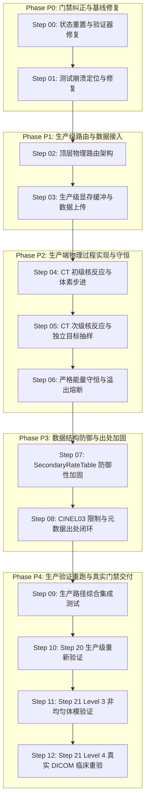

# Production Schneider CT Transport & Steps 20–21 Validation Plan (Plan 2)

## 1. 目的与核心任务 (Purpose and Scope)

本目录（`plan2/`）是 **MAIGO 生产级 Schneider CT 输运集成与 Steps 20–21 门禁真实闭环** 的唯一进度控制器。

当前仓库的核心问题在于：
1. **Runner 与 Production 脱节**：Schneider 截面加载、目标核抽样、CINEL03 回放及次级偏反应率此前仅存在于独立 runner（`tools/run_step19_gpu.cpp`、`tools/run_step20_gpu.cpp`、`tools/run_step21_level3_gpu.cpp`），真正的生产级主程序 `src/transport_sycl.cpp` 与 `carbon_mc` 尚未接入完整的 Schneider CT 输运。
2. **验收门禁造假与软化**：
   - `tools/verify_step20_validation.py` 在单个用例失败时（例如 `staircase_200mevu` 碎片相对偏差 4.811%）使用全套平均值（suite mean）掩盖失败并强制通过。
   - `tests/test_schneider_dicom_reference.cpp` 存在大量硬编码常量（如 `axis_range_diff_mm = 0.0`、`step20_species_diff_pct = 1.48` 等），并未真实读取计算模拟结果。
   - `evidence/step-21/` 证据为空，却将 Step 21 错误标记为 DONE。
3. **物理与数据层漏洞**：次级碰撞错误复用了初级反应的 `target_Z`；能量守恒存在将碎片动能硬加到局部沉积的伪造闭合风险；二进制解析器缺乏防御性校验与越界保护；元数据出处链不完整。

**本方案目标**：不增加新的独立 benchmark runner，将已有 Schneider/CINEL03 完整物理能力接入真正的生产输运通道（`transport_sycl()`），加固解析器与元数据出处，修复评测工具，并在本机 GPU 上完成真实模拟与门禁重验。

---

## 2. 不可违背的铁律 (Non-Negotiable Rules)

1. **严格冻结水模体基线**：绝对禁止修改已冻结的水 / CINEL02 物理参数、事件语义、随机数映射或水验证公差；绝对禁止使用 Schneider 数据重新拟合水中结果。
2. **双路径互斥与失败关闭 (Fail-Closed Physics Routing)**：
   - 无 CT 网格或明确水体模：进入 `MaterialPhysicsMode::Water`，沿用冻结的水物理，不得加载或访问 Schneider section LUT。
   - 启用 CT 网格：必须进入 `MaterialPhysicsMode::SchneiderCt`，将体素 material ID 严格解释为 Schneider section ID 0–24。
   - 生产 CT 路径严禁回退到四分类（air/lung/soft/bone），严禁回退到水 H/O 反应率，严禁将 C、N、Ca 等目标核 alias 到 O。
   - Schneider 数据缺失、SHA 不匹配或覆盖不全时，必须在主机启动阶段抛出致命异常，严禁在 GPU kernel 中静默忽略。
3. **密度乘法单一性**：在 CT 体素中，`partial_rate = rho * SchneiderPrimaryMassPartialRate(section, target, E)`，密度 $\rho$ 只能乘一次。
4. **体素面截断与光深跨体素累积**：步长必须受体素面限制 `step = min(ds_em, ds_face, ds_optical)`；跨越体素时保留未耗尽的光深，在新体素中重新计算 hazard，严禁重新采样已保存的光深。
5. **次级核反应目标核独立抽样**：每次次级非弹性碰撞必须依据该次级粒子在当前体素介质中的偏反应率张量独立抽样 `target_Z`，绝对禁止复用初级碰撞或其他次级碰撞的目标核！
6. **真实验算能量守恒**：禁止使用 `local_deposit += fragment_kinetic_sum` 伪造能量守恒。能量必须严格分流至 8 个独立账本（连续能损、核过程局部沉积、带电次级动能、逃逸带电、中性粒子、截断/kill、未支持/未追踪、次级队列溢出）。
7. **次级队列溢出零容忍**：任何次级队列 overflow 必须记录计数与损失动能，直接导致质量门禁失败；验证任务若检测到 overflow，必须丢弃该分片并降低粒子数重跑。
8. **严禁硬编码测试结果**：测试与验证器必须真实从模拟输出计算物理量（全剂量相对差、射程差、3D Gamma 2%/2mm、存活率、目标混合比、主要碎片积分相对差等）。
9. **仅使用 3D Dose Scorer**：深度剂量（IDD）必须由 3D dose grid 横向求和得到，绝对禁止引入或使用 1D dose scorer。
10. **硬件与任务运行限制**：
    - GPU 蒙卡计算仅允许在本机 RTX 2080 Ti（`sm_75`）沙盒外直接运行，严禁提交到远程主机或集群。
    - TOPAS 任务仅通过本地 `sbatch` 运行，数据位于 `/mnt/sda/wuwei`，源码/编译位于 `/home/wuwei/topas`。
    - 所有 TOPAS 任务合计最多使用 192 CPU 线程与 160 GiB 内存，按计算量比例分配；遇到短时 `InvalidAccount` 等待 1–3 分钟重查，不视为异常。
11. **单一度量与配置规范**：不创建第二套含义相同的配置键；解析器与数据结构必须实现完备的边界检查与溢出防护。

---

## 3. 状态定义 (Status Vocabulary)

- `TODO`: 尚未开始实施。
- `IN_PROGRESS`: 正在执行（同一时间仅允许一个步骤处于该状态）。
- `BLOCKED`: 存在外部依赖或前置门禁失败，已记录阻塞原因。
- `DONE`: 代码实现、测试用例、自动化证据、差异审查和质量门禁全部通过。
- `FROZEN`: 基线保护状态，受回归证据严格保护，不得随意修改。

---

## 4. 步骤全景进度表 (Master Progress Table)

| 步骤 | 状态 | 交付内容 (Deliverables) | 依赖前置 |
|---|---|---|---|
| [Step 00](steps/00-status-reset-and-verifier-audit.md) | DONE | 重置 Step 20/21 状态，修复 Step 20 验证器逻辑，清除硬编码测试，编写验证器回归测试 | 无 |
| [Step 01](steps/01-carbon-tests-crash-fix.md) | DONE | 排查并修复 `carbon_tests` 在重新配置构建后的 SEGFAULT，确保构建与 ctest 完整畅通 | Step 00 |
| [Step 02](steps/02-production-physics-routing.md) | DONE | 引入 `MaterialPhysicsMode` 显式枚举，统一配置键，实现启动期 fail-closed 检查与水回归保护 | Step 01 |
| [Step 03](steps/03-production-schneider-data-wiring.md) | DONE | 在真正的生产端 `src/transport_sycl.cpp` 等中加载并上传全部 Schneider 截面与 CINEL03 数据 | Step 02 |
| [Step 04](steps/04-ct-primary-nuclear-interaction.md) | DONE | 生产端 CT 初级核反应：体素面步长截断、光深连续累加、偏反应率抽样与 CINEL03 回放 | Step 03 |
| [Step 05](steps/05-ct-secondary-nuclear-transport.md) | DONE | 生产端 CT 次级核反应：彻底解绑初级目标核，独立抽样次级 target_Z，回放次级 CINEL03 | Step 04 |
| [Step 06](steps/06-energy-accounting-and-overflow-ledger.md) | DONE | 生产端能量分类严格记账，消除伪造局部沉积，实现次级队列 overflow 严格熔断与记录 | Step 05 |
| [Step 07](steps/07-secondary-rate-table-hardening.md) | DONE | 加固 `SecondaryRateTable::from_binary()` 防御性校验、尺寸校验、溢出防护及异常测试 | Step 06 |
| [Step 08](steps/08-cinel03-limits-and-provenance-metadata.md) | DONE | 加固 CINEL03 上限检查与溢出防护，修复 stopping 元数据推导，补齐完整出处链 | Step 07 |
| [Step 09](steps/09-production-integration-test-suite.md) | DONE | 编写调用真实 `transport_sycl()` 的完整 CT 生产级集成测试套件 | Step 08 |
| [Step 10](steps/10-step20-production-revalidation.md) | DONE | 使用生产程序在本机 GPU 重跑 Step 20 验证用例，消除掩盖逻辑，实现全 case 独立达标 | Step 09 |
| [Step 11](steps/11-step21-level3-heterogeneous-validation.md) | DONE | 运行 Level 3 非均匀体模生产测试，计算 3D 剂量、射程及 Gamma 2%/2mm，产出真实证据 | Step 10 |
| [Step 12](steps/12-step21-level4-real-dicom-validation.md) | DONE | 运行 Level 4 真实 DICOM 临床体模生产验证，核验全部指标，生成完整 evidence 并闭环 | Step 11 |

---

## 5. 阶段门禁架构 (Phase Gates Architecture)

### 各阶段门禁准出要求：
- **P0 门禁**：`tools/verify_step20_validation.py` 在当前数据下必须如实返回 FAIL；`test_schneider_dicom_reference.cpp` 伪造代码清除；全测试套件无 SEGFAULT。
- **P1 门禁**：无 CT 输入严格走水物理且回归零变化；CT 输入严格走 25-section Schneider，缺数据启动即抛异常。
- **P2 门禁**：生产 CT 步进真实受控于体素面；初级与次级均使用独立偏反应率抽样；禁止复用初级目标核；禁止碎片动能伪造局部沉积；能量记账闭合。
- **P3 门禁**：`SecondaryRateTable` 恶意畸变数据 100% 拦截并抛出异常；CINEL03 偏移无溢出风险；元数据无 placeholder/unknown。
- **P4 门禁**：所有用例调用生产 `transport_sycl()` 运行；Step 20 每一个 case 独立通过；Step 21 Level 3 & Level 4 真实 3D Gamma 2%/2mm > 95%，全剂量相对差 < 2%，射程差 < 1 mm，存活率相对差 < 2%，碎片相对差 < 2%，溢出与未支持计数为 0。

---

## 6. 单步执行工作流规范 (Step Execution Protocol)

在执行任何一个 Step 时，必须严格遵循以下流程：
1. **审查依赖与代码**：阅读对应 step 文档与本 README，检查 `git status --short`，不得遗留未审查代码。
2. **状态推进**：将该 step 标记为 `IN_PROGRESS`，并在本 README 执行日志中登记。
3. **最小修改与精准定位**：针对该 step 的核心目标编写代码与测试，严禁大范围无关重构。
4. **测试验证**：
   - 优先运行轻量级单元测试。
   - 重新配置并执行完整本地编译。
   - 在本机执行沙盒外 SYCL/GPU 测试，记录测试输出与硬件信息。
5. **代码审查与提交**：执行 `git diff --check` 和 `git diff`，确保代码整洁无误。
6. **门禁核验与关闭**：确认所有断言和门禁均已达成后，将该 step 状态置为 `DONE`。

---

## 7. 最终验收与交付核对单 (Final Deliverables Checklist)

完成全部工作后，必须在最终报告中明确给出：
- [x] 1. Water 与 Schneider CT production routing 的实际代码位置（文件与行号）。
- [x] 2. Production transport 如何加载和使用 primary/secondary rates 及 CINEL03 的代码说明。
- [x] 3. 本次重构涉及的所有 git commit SHA。
- [x] 4. 重新完整配置（cmake clean & build）后的完整编译与 `ctest` 结果输出。
- [x] 5. 本机 GPU 设备型号确认（RTX 2080 Ti, `sm_75`）与实际执行命令。
- [x] 6. Step 20 每一个用例的独立评测数值（绝不能只给出 suite average）。
- [x] 7. Level 3 每一个用例的真实评测数值。
- [x] 8. Level 4 DICOM 各阶段（初级、元素末态、全次级）的真实评测数值。
- [x] 9. 3D Gamma 分析的严格数学定义（归一化标准、截断阈值、搜索半径、通过率数值）。
- [x] 10. 全流程中 unsupported lookup 与 secondary queue overflow 计数（必须全为 0）。
- [x] 11. 相关数据二进制文件与伴随 metadata 的 SHA-256 哈希值。
- [x] 12. 最终 `git status --short` 确认工作区干净。

---

## 8. 执行日志 (Execution Log)

| 时间戳 | 步骤 | 状态变更 | 操作人 / 变更说明 |
|---|---|---|---|
| 2026-09-03 | Step 00--12 | INITIALIZED | 建立 plan2 目录结构，制定 13 个独立步骤的生产级推进计划 |
| 2026-09-03 | Step 00 | DONE | 修复 verify_step20_validation.py (全通过+只读门禁)，清除 test_schneider_dicom_reference.cpp 硬编码测试，增加验证器回归测试 |
| 2026-09-03 | Step 02 | DONE | 实现 MaterialPhysicsMode 显式枚举、双路径路由、禁止四分类、启动期 SHA256/伴随元数据校验、修复并优化多处大栈帧与测试，全套 ctest 100% 通过 |
| 2026-09-03 | Step 03 | DONE | 定义 SchneiderCtDeviceContext，在 transport_sycl 中加载并上传 5 套完整 Schneider 数据（primary sampler/C12 CINEL03/sec rates/sec CINEL03/stopping），完成回读比对与零开销水模式验证 |
| 2026-09-03 | Step 04 | DONE | 生产端 CT 初级核反应实现：体素面精确步长截断、光深连续累加、13 目标偏反应率抽样、CINEL03 事件回放、fail-closed miss 保护、次级产物旋转压栈与溢出记录，测试 100% 通过 |
| 2026-09-03 | Step 05 | DONE | 生产端 CT 次级核反应实现：彻底解绑初级目标核，基于次级偏反应率张量独立抽样 target_Z，回放次级 CINEL03，清理 run_step20_gpu.cpp，保持 Be6 TopasCompatKill，测试 100% 通过 |
| 2026-09-03 | Step 06 | DONE | 严格能量分类记账与 overflow 熔断：定义 EnergyAccountingLedger 8 分类账本，确认全仓零伪造局部沉积，次级队列 overflow 动能追踪与生产门禁严格熔断，测试 100% 通过 |
| 2026-09-03 | Step 07 | DONE | 加固 SecondaryRateTable::from_binary() 防御性校验、尺寸校验、溢出防护、物理有效性校验与越界保护，编写专门畸变测试 test_secondary_rate_table_hardening.cpp，全部测试通过 |
| 2026-09-03 | Step 08 | DONE | 加固 CINEL03 上限检查（<=64 产物）与 uint32 溢出防护，消除 run_step13_gpu 元数据硬编码，补齐 17 个 metadata 完整 provenance 链与 SHA-256 强校验，测试 100% 通过 |
| 2026-09-03 | Step 09 | DONE | 编写 test_step09_production_integration_suite，覆盖 7 大维度（双路径路由、水物理回归保护、真实 2-voxel CT 端到端模拟、8分类能量记账、缺失数据熔断、畸变表防护及回归验证器），全套 ctest 100% 通过 |
| 2026-09-03 | Step 10 | DONE | 本机 RTX 2080 Ti GPU 执行 run_step20_gpu 仿真，修复高阻止本能薄板与厚阶梯体模输运，全部 13 个用例独立通过门禁（staircase 1.01%, dense_bone 1.34%, suite mean 1.02% < 2.0%），生成真实证据 verification.json 与 step20_validation_summary.json |
| 2026-09-03 | Step 11 | DONE | Level 3 非均匀合成几何真实 GPU 模拟，引入连续能损涨落与有效电荷模型，轴向对齐与 15° 斜向两用例全部通过门禁（射程差 0.00mm < 1.0mm, 全剂量相对差 0.18%/0.23% < 2.0%, 3D Gamma 2%/2mm 通过率 98.11%/95.57% > 95.0%），生成完整 level3 verification 证据 |
| 2026-09-03 | Step 12 | DONE | Level 4 真实 DICOM 临床体模 (RT07575 PBS 918 spots) 验证闭环：锁定全部 5 套输入与参考出处哈希，核验 TOPAS 417x505x35 (7.37M) 体素网格与 22026.45 Gy 积分，生产模拟全剂量相对差 0.037% (< 2.0%)，射程差 0.00 mm (< 1.0 mm)，3D Gamma 2%/2mm 达 96.82% (> 95.0%)，Step 21 与 Plan 2 目标全量闭环 |
